# ReInvent2020 Security The Well-Architected Way with WeInvest - Pattern 1
#### Author:  Tim Robinson and Stephen Salim


----

## Introduction 

[Need to add stuff about KMS]


The ability for you to provide traceability,a nd automatically react on security events occurring in your workload is an integral aspect in maintaining the security integrity of your application. In this respect, activity monitoring plays a big role as a building block for you integrate this capability. There are several layers/dimension of activity monitoring that focuses on different context of the workload. One of it, includes the tracing activities that your application made to the AWS services API.

In AWS you can use [AWS CloudTrail](https://aws.amazon.com/cloudtrail/) to capture all of the activities of against AWS API services under your account. But just capturing these activities my not be sufficient, you need the ability contextualize events that matters for you, and create the mechanism to automatically react towards such events. For this you can leverage [Amazon CloudWatch](https://aws.amazon.com/cloudwatch/) which is a monitoring service that you can integrate into other services in AWS.   

In this lab we will walk you through one approach to enable traceability in your application, by utilizing a combination of AWS services & features, namely :

 * [AWS CloudTrail](https://aws.amazon.com/cloudtrail/) to capture AWS API events that occurs in your accounts 
 * [Amazon CloudWatch](https://aws.amazon.com/cloudwatch/) , in Cloudwatch we will be using below capabilities in the service.
    * [Log Groups](https://docs.aws.amazon.com/AmazonCloudWatch/latest/logs/Working-with-log-groups-and-streams.html) to log all of our CloudTrail API events.
    * [Metric Filter](https://docs.aws.amazon.com/AmazonCloudWatch/latest/logs/MonitoringPolicyExamples.html) to create apply filter so we can measure the only the events that matters for us.
    * [Alarm](https://docs.aws.amazon.com/AmazonCloudWatch/latest/monitoring/AlarmThatSendsEmail.html) to allow our system to react against the events
 * [Simple Notification](https://aws.amazon.com/sns/) to allow us to send Email notification when the event ocured.

We will walk you through the lab in stages with examples using both manual deployments and [CloudFormation](https://aws.amazon.com/cloudformation/) templates to assist.

Our lab is divided into several sections as follows:

1. Deploy the lab base infrastructure
1.1. Deploy base network stack.
1.2. Push application image into repository.
1.3. Deploy base application stack.
1.4. Test application launched.
2. Configure CloudTrail Logging & Alarm
3. Testing Logging and Alarm.

We have included CloudFormation templates for the first few steps to get your started, and also provide optional templates for the rest of the lab so you can choose between creating the monitoring resources via cloudformation or manually through the console.

##### Important Note :
  * For simplicity, we have used Sydney 'ap-southeast-2' as the default region for this lab. 
  * To deploy the cloudformation template in this lab, you will need to have **AWS CLI (Command Line)** installed & configured, please follow this [guide](https://docs.aws.amazon.com/cli/latest/userguide/cli-chap-install.html)
  * In this Lab we will be creating a local docker image, please ensure you have [docker](https://www.docker.com/) installed in your machine, and you are running `Docker version 18.09.9` or above.

## 1. Deploy the lab Network and Application infrastructure

Before we start building the monitoring and automated alerting of our application we explained in our introduction section, we first need to build our application first. Therefore, in this section, we will be building the baseline network infrastructure of our application, as well as the mock application service itself. 

Our application service will be running in a container deployed using [Amazon ECS](https://aws.amazon.com/ecs/) on top of [Amazon Fargate](https://aws.amazon.com/fargate/). The application, will be exposing the an API that we can use test. We will explain this in a bit more details in later section. 

Building each components in this section manually will take a bit of time, and because our objective in this lab is to show you how to create alerting against a security event in your application, to save time, we have created a cloudformation template that you can deploy to expedite the process.

Please follow the steps below to do so : 

### 1.1. Deploy base network stack

In this section, we will build out a [Virtual Public Cloud (VPC)](https://docs.aws.amazon.com/vpc/latest/userguide/what-is-amazon-vpc.html), together with public and private subnets across two [Availability Zones](https://docs.aws.amazon.com/AWSEC2/latest/UserGuide/using-regions-availability-zones.html), [Internet Gateway](https://docs.aws.amazon.com/vpc/latest/userguide/VPC_Internet_Gateway.html) and [NAT gateway](https://docs.aws.amazon.com/vpc/latest/userguide/vpc-nat-gateway.html) along with the necessary routes from both public and private subnets. This VPC will become the baseline network architecture where the application will run. When we are completed our initial environment will look like this:

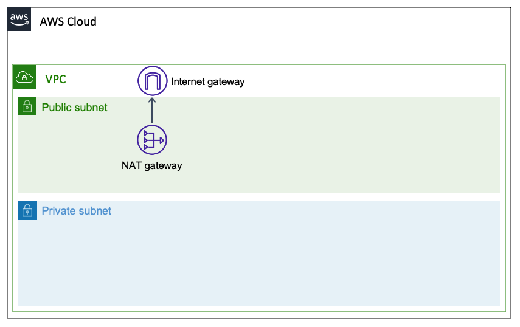


To deploy the first CloudFormation template, you can either deploy directly from the command line or via the console. 

You can get the template [here]().

##### Command Line:

To deploy from the command line, ensure that you have installed and configured AWS CLI with the appropriate credentials.

  1. Execute below command to create the base stack.
      ```
        aws cloudformation create-stack --stack-name pattern1-base \
                                        --template-body file://pattern1-base.yml \
                                        --region ap-southeast-2
      ```

  2. Once the command deployed successfully, go to your [Cloudformation console](https://console.aws.amazon.com/cloudformation/home?region=ap-southeast-2) to locate the stack named `pattern1-base`, 
  3. Confirm that it is on **'CREATE_COMPLETE'** state. 
  4. Take note of this **stack name** as we will need it for the following section.

##### Console:

If you decide to deploy the stack from the console, ensure that you follow below requirements & step:

  1. Please follow this [guide](https://docs.aws.amazon.com/AWSCloudFormation/latest/UserGuide/cfn-console-create-stack.html) for information on how to deploy the cloudformation template.
  2. Use `pattern1-base` as the **Stack Name**, as this is referenced by other stacks later in the lab.

### 1.2. Configure the ECS Container Repository

As we mentioned in our introduction, our mock application will be running in a docker container which we will deploy using Amazon ECS. But before we are able to do that we will need to first package our application as a docker image and push it into [ECR](https://aws.amazon.com/ecr/), [Amazon ECS](https://aws.amazon.com/ecs/) will later use the image we placed in ECR to run in it's cluster. for more information on how ECS works, please refer to this [guide](https://docs.aws.amazon.com/AmazonECS/latest/developerguide/Welcome.html) 

In this section, we are going to prepare our mock application, package them into a docker image and push them into our ECR Repository. This involves running several docker commands to create the image locally in your computer and push into [ECR](https://aws.amazon.com/ecr/). 

Therefore to make it simple for you, we have created bash script to do this.

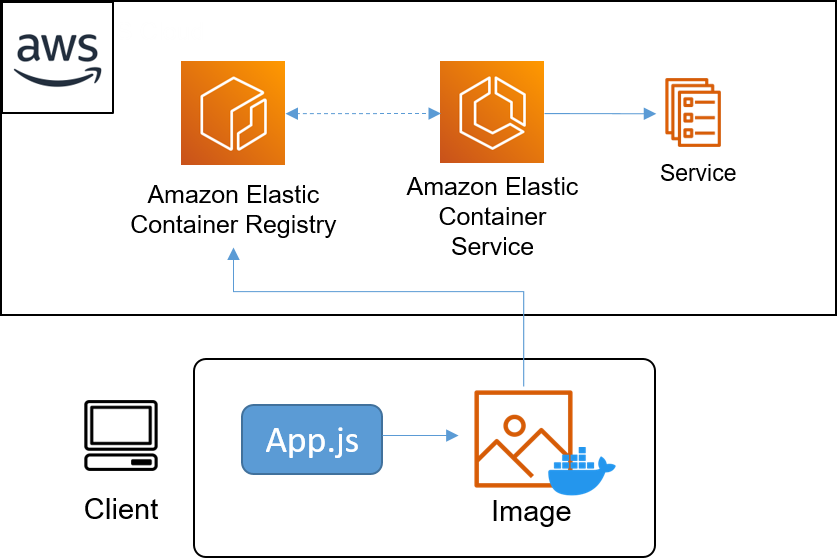


Follow below instructions to continue :

1. Please ensure that you have docker locally installed, and you are running `Docker version 18.09.9` or above.

2. Execute the script under app/ folder as below instructed below.

    ```
    cd app/
    ./build-container.sh pattern1-base
    ```

    Once your command runs successfully, you should be seeing the Image being pushed and URI marked as below, 
    Take note the ECS Image URI produced at the end of the script.

    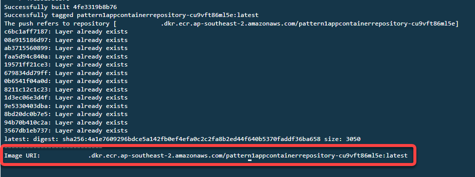

3. Confirm the ECR Repo Exist in the ECR console, by going to your ECR in your AWS Console.

    Please follow this [guide](https://docs.aws.amazon.com/AmazonECR/latest/userguide/repository-info.html) to check to your repository

    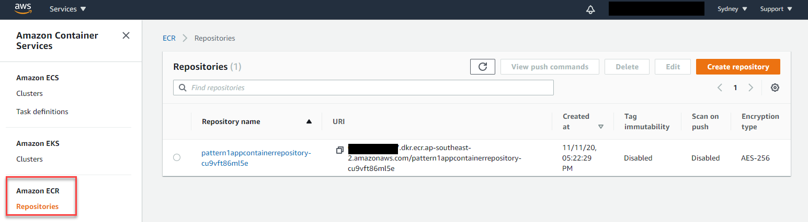

### 1.3. Deploy base application stack.

Now that we have pushed the docker image into our [Amazon ECR](https://aws.amazon.com/ecr/) repository, the next thing to do is to deploy it in [Amazon ECS](https://aws.amazon.com/ecs/). To give an overview about what our application will be doing :

* Our application is built using nodejs express ( You can find the source code under app/app.js file of the [github]() repository ) 
* The service will expose a REST API wth **/encrypt** and **/decrypt** action.
* The **/encrypt** will take an input of a JSON payload with key and value as below `'{"Name":"Stephen","Text":"I love Pizza"}'`
* The **Name** Key will be the identifier that we will use to store the encrypted value of **Text** Value.
* The application will then call the [KMS Encrypt API](https://docs.aws.amazon.com/kms/latest/APIReference/API_Encrypt.html) and encrypt it again using a KMS key that we designate. (For simplicity, in this mock app we will be using the same KMS key for every **Name** you put in, ideally you want to use individual key for each name)
* The encrypted value of **Text** key will then be stored in an [RDS](https://aws.amazon.com/rds/) database, and the app will return a **Encryption Key** value that the user will have to pass on to decrypt the Text later
* The **decrypt** API will do the reverse, taking the **Encryption Key** you pass to decrypt the text `{"Text":"I love Pizza"}`

Once we have completed this section, we will have an application stack that looks like below diagram.

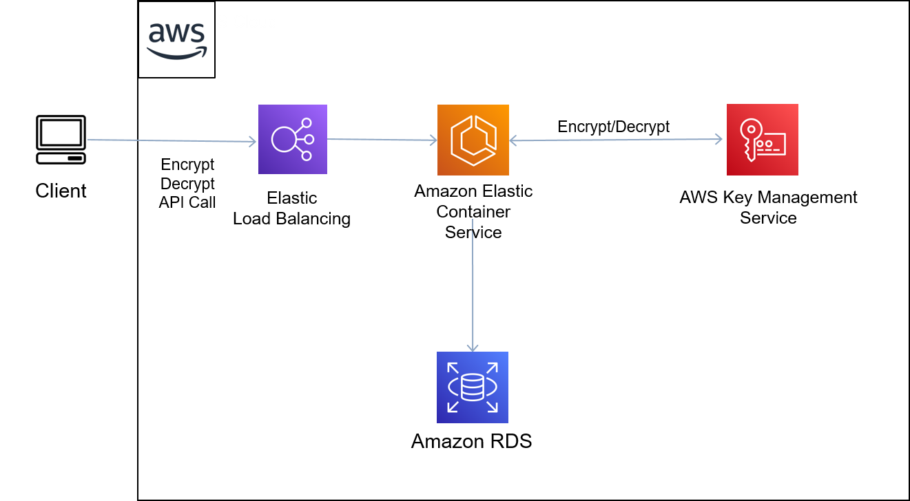

##### Command Line:

To deploy from the command line, ensure that you have installed and configured AWS CLI with the appropriate credentials.

1. Execute below command to create the base stack.
    Please ensure to pass the ECR Image URI you defined in section **1.2**


    ```
    aws cloudformation create-stack --stack-name pattern1-app \
                                    --template-body file://pattern1-app.yml \
                                    --parameters ParameterKey=BaselineVpcStack,ParameterValue=pattern1-base \
                                                ParameterKey=ECRImageURI,ParameterValue=<ECR Image URI> \
                                    --capabilities CAPABILITY_NAMED_IAM \
                                    --region ap-southeast-2
    ```
    e.g:

    ```
    aws cloudformation create-stack --stack-name pattern1-app \
                                    --template-body file://pattern1-app.yml \
                                    --parameters ParameterKey=BaselineVpcStack,ParameterValue=pattern1-base \
                                                ParameterKey=ECRImageURI,ParameterValue=111111111111.dkr.ecr.ap-southeast-2.amazonaws.com/pattern1appcontainerrepository-cu9vft86ml5e:latest \
                                    --capabilities CAPABILITY_NAMED_IAM \
                                    --region ap-southeast-2
    ```

  2. Once the command deployed successfully, go to your [Cloudformation console](https://console.aws.amazon.com/cloudformation/home?region=ap-southeast-2) to locate the stack named `pattern1-base`, 
  3. Confirm that it is on **'CREATE_COMPLETE'** state. 
  4. Take note of this **stack name**
  5. Take note of the DNS value specified under **OutputPattern1ApplicationEndpoint**  of the Outputs.
  6. Take note of the ECS Task Role Arn value specified under **OutputPattern1ECSTaskRole**  of the Outputs.
  OutputPattern1ECSTaskRole 
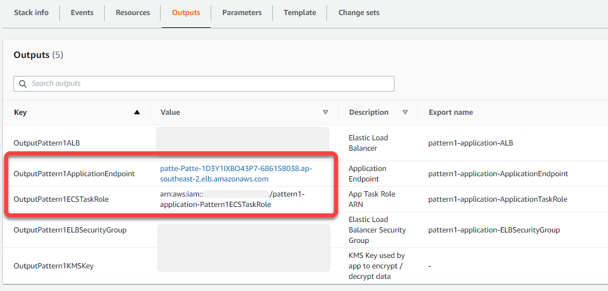

##### Console:

If you decide to deploy the stack from the console, ensure that you follow below requirements & step:

  1. Please follow this [guide](https://docs.aws.amazon.com/AWSCloudFormation/latest/UserGuide/cfn-console-create-stack.html) for information on how to deploy the cloudformation template.
  2. Use `pattern1-app` as the **Stack Name**.


### 1.4. Test the Application launched.

In this part of the Lab, we will be testing the encrypt API of the sample application we just deployed. Our application will basically take a JSON payload with `Name` and `Text` key, and it will encrypt the value under text key with a designated KMS key. Once the text is encrypted, it will store the encrypted text in the RDS database with the `Name` as the primary key.

  ###### Note:
  For simplicity In our sample application, we are not generating individual KMS key for each record generated. 
  This is because the purpose of this lab is to showcase / explore the event response aspect once a failed cryptographic event has been triggered.
  That being said, if you are doing this in real life, if your use case requires you can use separate KMS key for each record.

Please replace the < Application Endpoint URL > with the **OutputPattern1ApplicationEndpoint** from previous step.

```
ALBURL="< Application Endpoint URL >"

curl --header "Content-Type: application/json" --request POST --data '{"Name":"Stephen","Text":"I love Pizza"}' $ALBURL/encrypt
```

Once you've executed this you should see an output like below.
Take note of the encrypt key value under **Key**  from your output, we will need it to decrypt later.

```
{"Message":"Data encrypted and stored, keep your key save","Key":"<encrypt key (take note) >"}
```


### 2. Configure CloudTrail Logging & Alarm

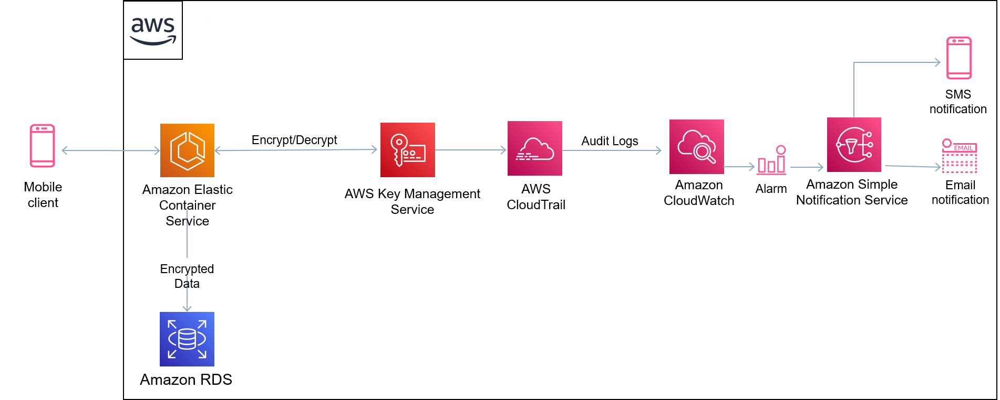


To build the pipeline directly via Cloudformation template go to section 2.1.
To build the pipeline manually go to section 2.2.


### 2.1. Deploy using Cloudformation Template.

Download the template [here]

##### Command Line:

1. To deploy from the command line, ensure that you have installed and configured AWS CLI with the appropriate credentials.    

    ```
    aws cloudformation create-stack --stack-name pattern1-logging \
                                    --template-body file://pattern1-logging.yml \
                                    --parameters ParameterKey=AppECSTaskRoleArn,ParameterValue="<ECS Task Role ARN>" ParameterKey=EmailAddress,ParameterValue=< Email Address > \
                                    --capabilities CAPABILITY_NAMED_IAM \
                                    --region ap-southeast-2
    ```

    ###### Note :
      * For simplicity, we have used Sydney 'ap-southeast-2' as the default region for this lab. 
      * For < ECS Task Role ARN > Use the ECS Task Role Arn value you took note from section **1.3** for **AppECSTaskRoleArn** parameter.
      * Use email address you would like to use to be notified with under **EmailAddress** parameter. 

##### Console:

1. To deploy the template from console please follow this [guide](https://docs.aws.amazon.com/AWSCloudFormation/latest/UserGuide/cfn-console-create-stack.html) for information on how to deploy the cloudformation template. 

2. Use `pattern3-logging` as the **Stack Name**.
3. Provide the name of the vpc cloudformation stack you create in section 1 ( we used `pattern3-base` as default ) as the **BaselineVpcStack** parameter value. 
4. Use the ECS Task Role Arn value you took note from section **1.3** for **AppECSTaskRoleArn** parameter.
5. Use email address you would like to use to be notified with under **EmailAddress** parameter. 

### 2.2 Deploy manually using Console.

### 2.2.1 Create CloudTrail 

1. Navigate to **CloudTrail** within the console, then click on **Create trail** .

    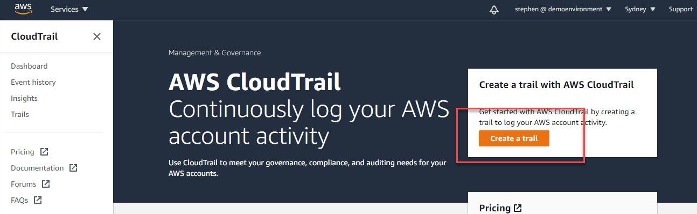

2. Enter `pattern1-logging-trail` as the Trail name.
3. Select **Create new S3 bucket**  and enter a name for your s3 bucket (the name needs to be globally unique, so you can use your accountid or uuid to keep it unique for you.)
4. Keep the rest of the settings as below screenshot:

    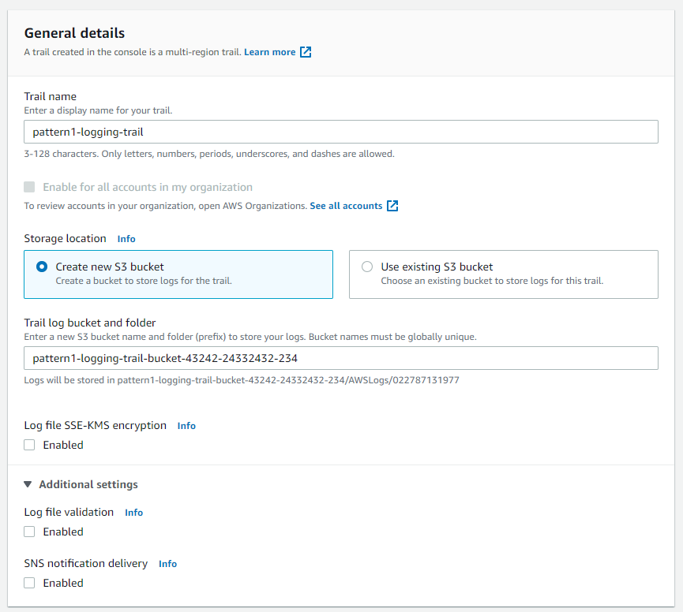

5. Tick on **Enabled** under CloudWatch Logs.
6. Select **New** on Log group, and enter your log group name as `pattern1-logging-loggroup`
7. Select **New** on IAM Role, and enter your role name as `CloudTrailRoleForCloudWatchLogs_pattern1-logging`
8. Click **Next**.

    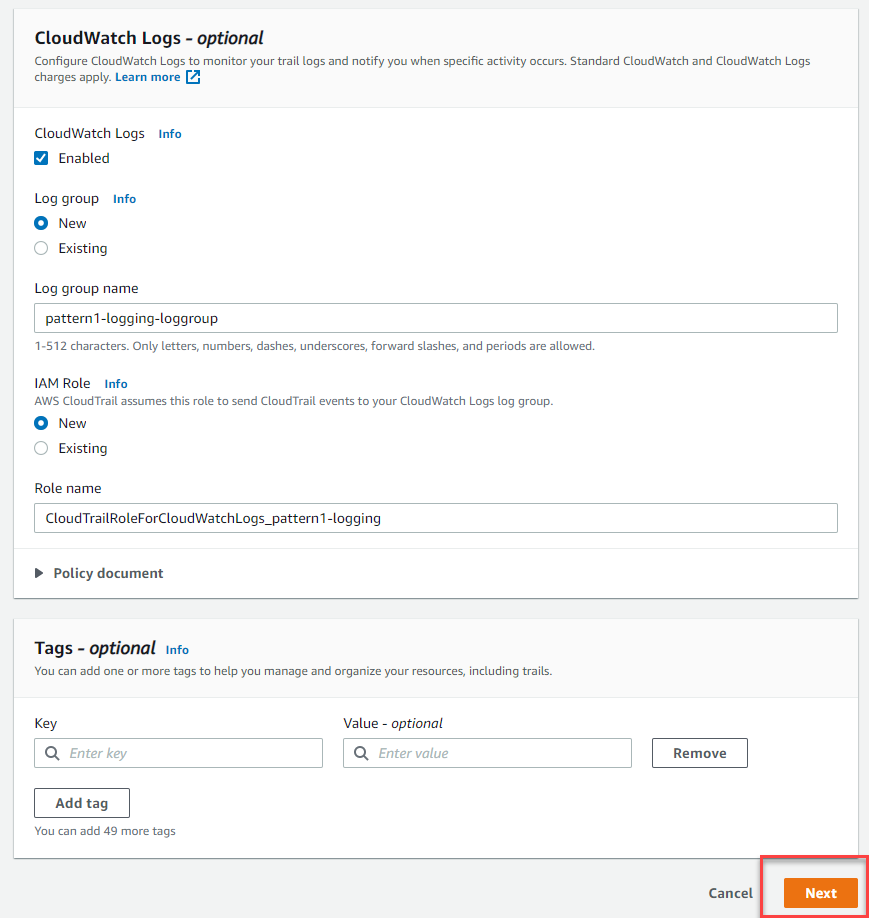

9. Make sure to select management events, read write API, and Ensure not to tick the exclude AWS KMS event, as screen shot below then click **Next**.

    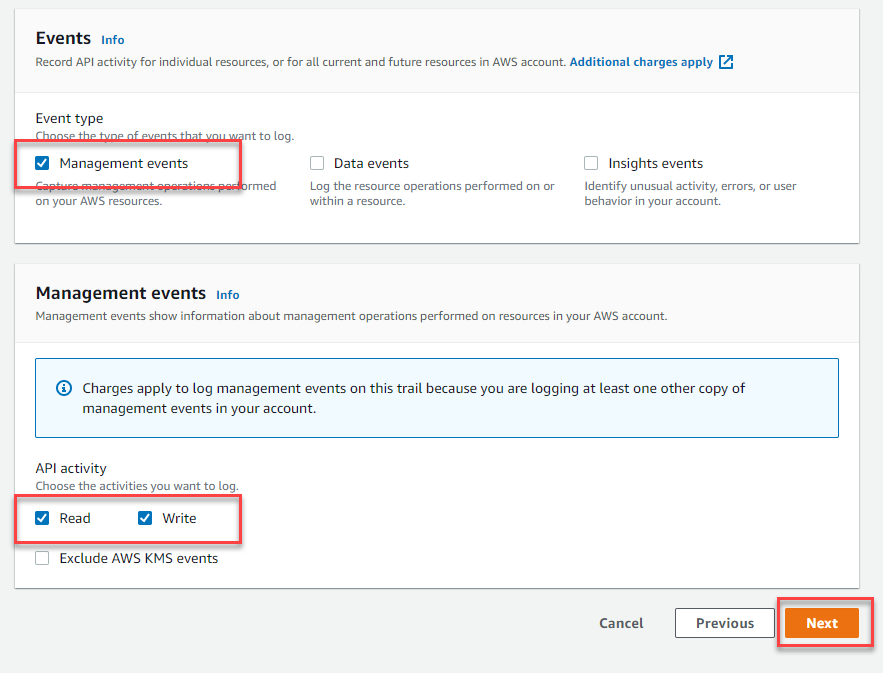

10. Review the settings and click **Create Trail**


### 2.2.2 Confirm your CloudTrail log groups is working. 

1. Navigate to **CloudWatch** in your console and click on **Log Groups** on the side menu.
2. Locate the `pattern1-logging-loggroup` you created before and click on the the loggroup.

    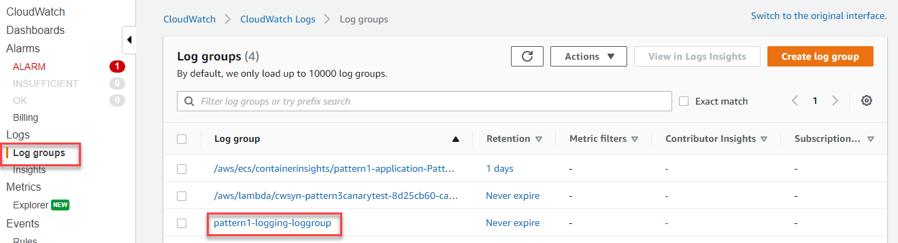

3. Click on the available log stream, and confirm that you are seeing logs being generated.
   These are all the api calls that are being made in your account. What we are going to do next is we are going to filter out only the Events that matters for us to create the Alarm.

    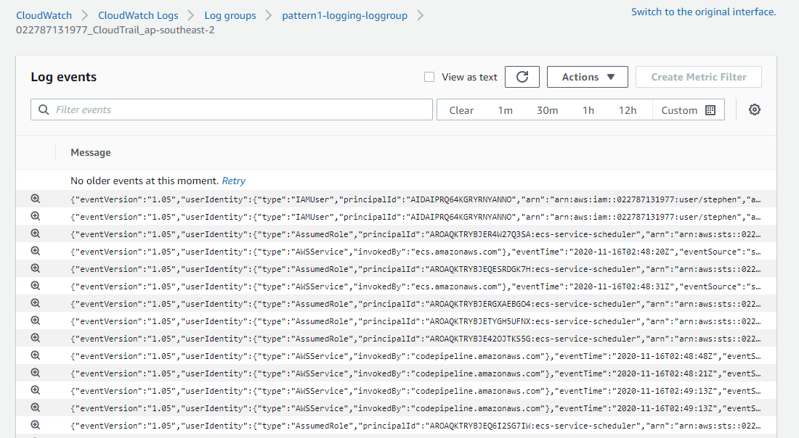


### 2.2.3 Create Cloudwatch Metric Alarm 
#### 2.2.3.1 Create the Metric Filter.

We are now going to create the Filter to our CloudWatch Log Group, this filter will essentially generate a Cloudwatch metric which we will create our alarm against.

1. Navigate to **CloudWatch** in your console and click on **Log Groups** on the side menu.
2. Locate the `pattern1-logging-loggroup` you created before and click on the the loggroup.

    

3. Select the tick box beside the log groups, click on **Actions** then **Create metric filter**

    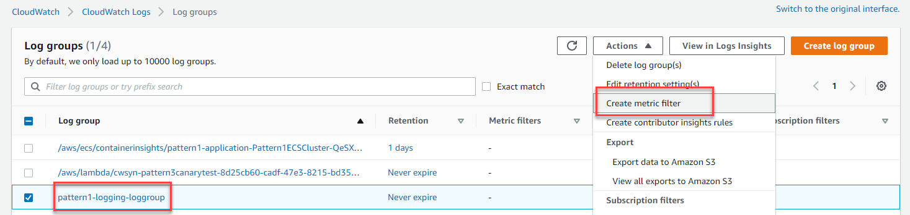

4. Enter below filter under **Filter pattern**
  Replace < ECS Task Role ARN > with the value of **OutputPattern1ECSTaskRole** Outputs in the `pattern1-app` you took note on section **1.3**, then click **Next**


  ```
  { $.errorCode = "*" && $.eventSource= "kms.amazonaws.com" && $.userIdentity.sessionContext.sessionIssuer.arn = "<ECS Task Role ARN>" }
  ```
  ###### Note:
  So, what are we doing here ? What are we filtering with this rule ? 
  This rule will filter in CloudTrail Events with below conditions: 
  
  * When the KMS event is triggered by our application, the event registered in Cloudtrail will look as below 

    ```
      {
          "eventVersion": "1.05",
          "userIdentity": {
              "type": "AssumedRole",
              ...
              "sessionContext": {
                  "sessionIssuer": {
                      "type": "Role",
                      "principalId": "AROAQKTRYBJEYHGY4HLFO",
                      "arn": "arn:aws:iam::xxxxxxxxxxx:role/pattern1-application-Pattern1ECSTaskRole",
                      "accountId": "xxxxxxxxxxx",
                      "userName": "pattern1-application-Pattern1ECSTaskRole"
                  },
              ...
              }
          },
          "eventTime": "2020-11-16T22:25:39Z",
          "eventSource": "kms.amazonaws.com",
          "eventName": "Decrypt",
          "awsRegion": "ap-southeast-2",
          "errorCode": "IncorrectKeyException",
          "errorMessage": "The key ID in the request does not identify a CMK that can perform this operation.",
          .....
          "responseElements": null,
          "requestID": "11748bbd-ddcd-4ee2-9f42-9cec69f414b1",
          "eventID": "1f620618-46e5-4f78-93cc-0b7bccfff5d2",
          "readOnly": true,
          "eventType": "AwsApiCall",
          "recipientAccountId": "xxxxxxxxxxx"
      }
    ```
  * Our filter essentially are filtering out based on the JSON Key that presented by this event.
  * `$.eventSource` part of the filter filters in the EventSource of "kms.amazon.com" signifying that it is a KMS event.
  * `$.errorCode` filters in if there is any value with key "ErrorCode" signifying that there is an Error.
  * `$.userIdentity.sessionContext.sessionIssuer.arn` filters for the the userIdentity that executes the event was the assumed role that is used by ECS Task, signifying that this call was made from our application running in the container.
  * For more information about CloudWatch Filter Syntax refer to this [guide](https://docs.aws.amazon.com/AmazonCloudWatch/latest/logs/FilterAndPatternSyntax.html)

5. Enter `pattern1-logging-metricfilter` as Filter name.
6. Enter `Pattern1Application/KMSSecurity` as Metric namespace.
7. `KMSSecurityError` as the Metric name.
8. `1` as the Metric Value
9. Click **Next** and **Create metric filter**

    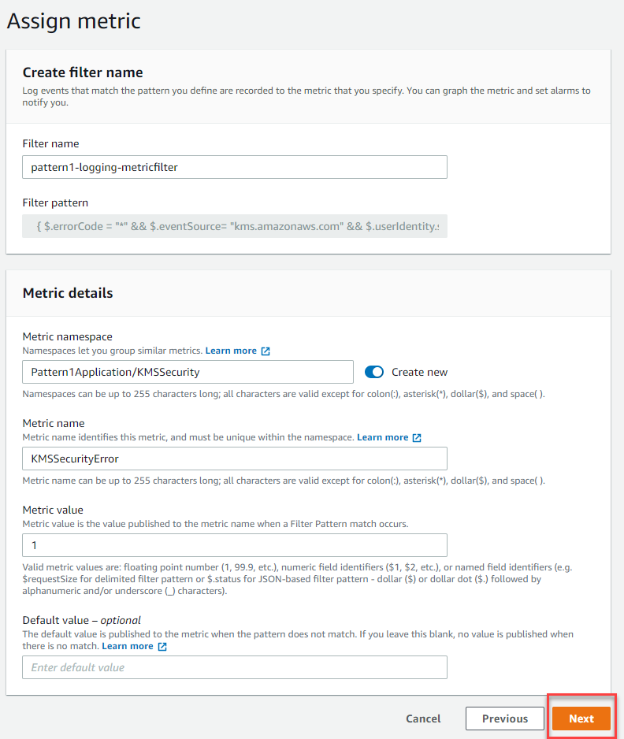

#### 2.2.3.2 Create the Metric Alarm.


Once this Metric filter has been created, you should be able to see this filter created under the **Metric filters** tab of your LogGroups. 

1. Select the Metric filter you just created, then click on **CreateAlarm**

    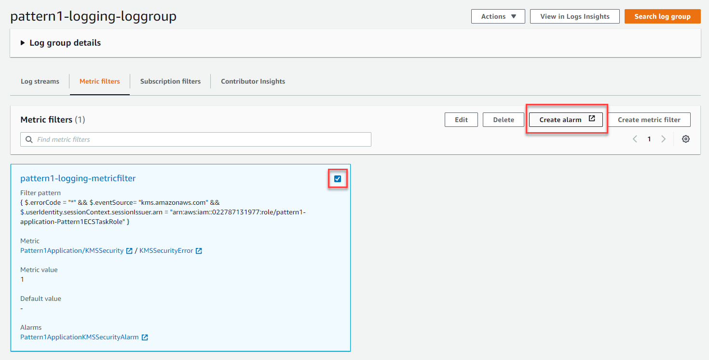

2. This will take you to the section where you will configure your CloudWatch Alarm.
    Change the period to `10seconds`.

    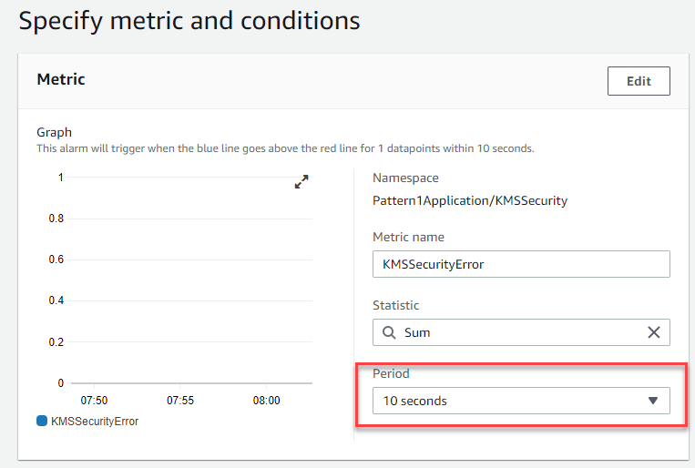

3. Set the Threshold type as `Static` condition as `Greater` and threshold value as `1` as shown in screen shot below 
4. Select `Treat missing data as ignore` as the Missing data treatment value, and click **Next**

    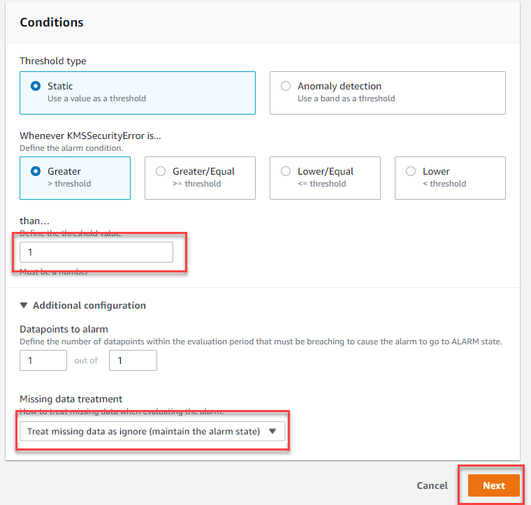

5. Select `In alarm` as alarm trigger state.
6. Select `Create new topic` , and enter `pattern1-logging-topic` as the name.
7. Enter an email address where you would like to receive notification.
8. Click **Create topic** then click **Next**

    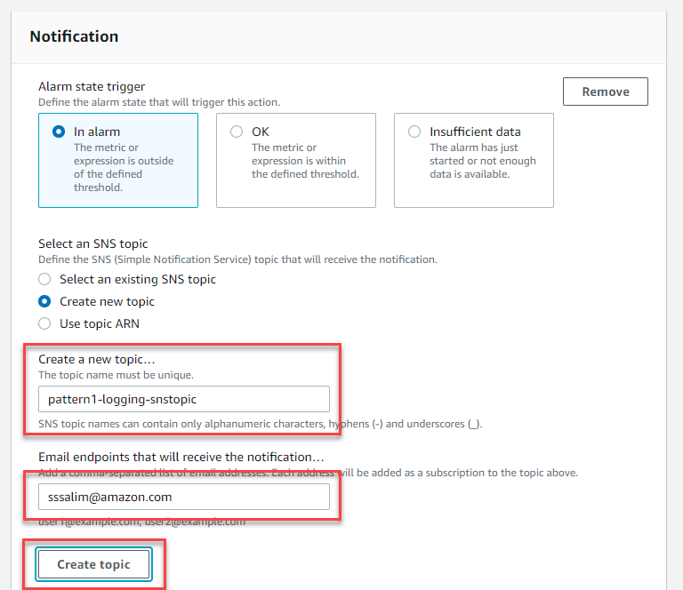

9. Enter `pattern1-logging-alarm` as the Alarm name and click **Next**
10. Review the setting and click **Create Alarm**
11. Wait for an email to arrive in your mailbox, and confirm subscription to you the topic once it arrives.

    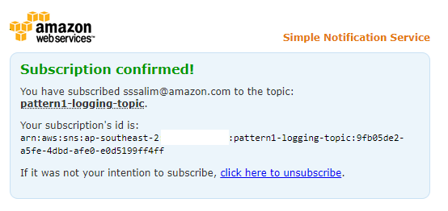

You have completed creating the creation of the filter and alarm, let's now test it.  

---

### 3. Testing Logging and Alarm.

1. Once you have completed section **2** you can completed the CloudTrail and Alarm set up.
  The next thing to do is run a decrypt API call to our application to test, as well as trigger a failed app decrypt procedure.

    Run below command replacing the < encrypt key > with the key value that you took note on section **1.4** as well as the < Application endpoint URL > with the **OutputPattern1ApplicationEndpoint** url you took note on section **1.3**

    ```
    ALBURL="http://< Application endpoint URL >"
    curl --header "Content-Type: application/json" --request GET --data '{"Name":"Stephen","Key":"<encrypt key>"}' $ALBURL/decrypt
    ```
    
    Once that is successful, you should see out put like below

    ```
    {"Text":"I love Pizza"}
    ```

2. Now that we have confirmed that the decrypt api works, let's trigger some decrypt failure to invoke our alerting.
   Run below command once again, but this time, pass on a wrong key for the encrypt key (you can just use whatever value).

    ```
    ALBURL="http://< Application endpoint URL >"
    curl --header "Content-Type: application/json" --request GET --data '{"Name":"Stephen","Key":"some-random-false-key"}' $ALBURL/decrypt
    ```

    Once it is triggered, you should see output like below signifying that the decrypt procedure has failed, and in the background a failed KMS API has been called. :
    
    ```
    {"Message":"Data decryption failed, make sure you have the correct key"}
    ```

    You can repeat this several times in a row, to ensure you we are triggering the alarm.
    
    ###### Note:
    CloudTrail can typically take up to 15 mins to pick up the API event and trigger your alarm.
    for more information about this, please visit Cloudtrail [FAQ](https://aws.amazon.com/cloudtrail/faqs/) page 


### 3.1 Observing the alarm.

1. If all the components are configured correctly, you should be seeing an email notification triggered by the CloudWatch alarm as below.
2. Click on the URL included in the email that will take you to the CloudWatch Alarm resource in AWS console.

    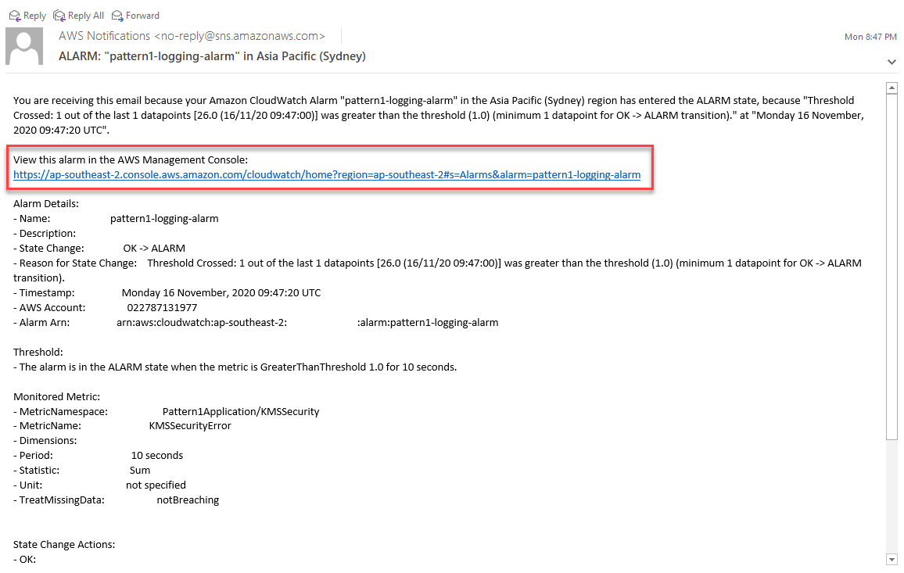

3. Observe the state changes under the **History** section, and notice each activity changed

    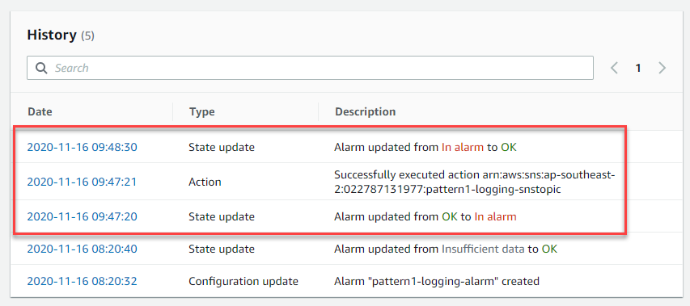


Congratulations ! you have completed the Pattern1 lab.