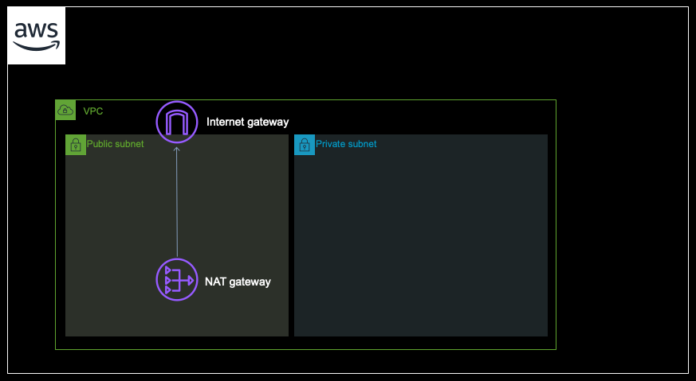
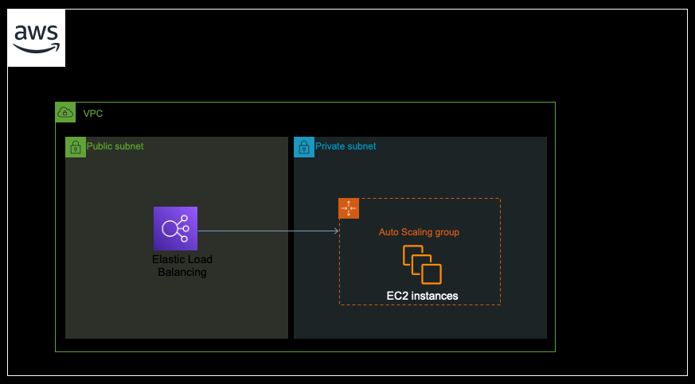
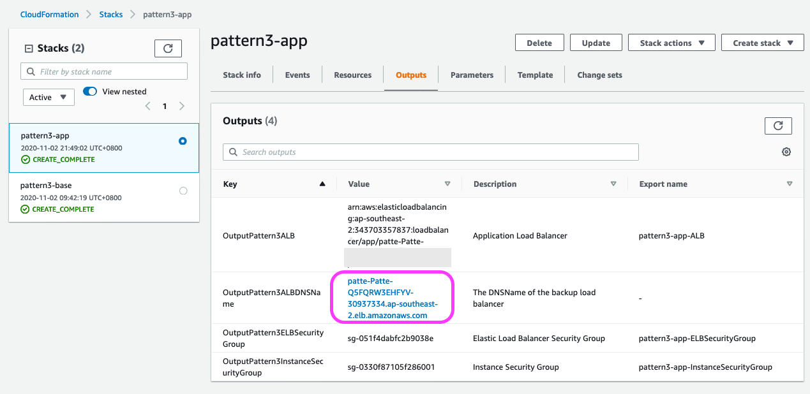
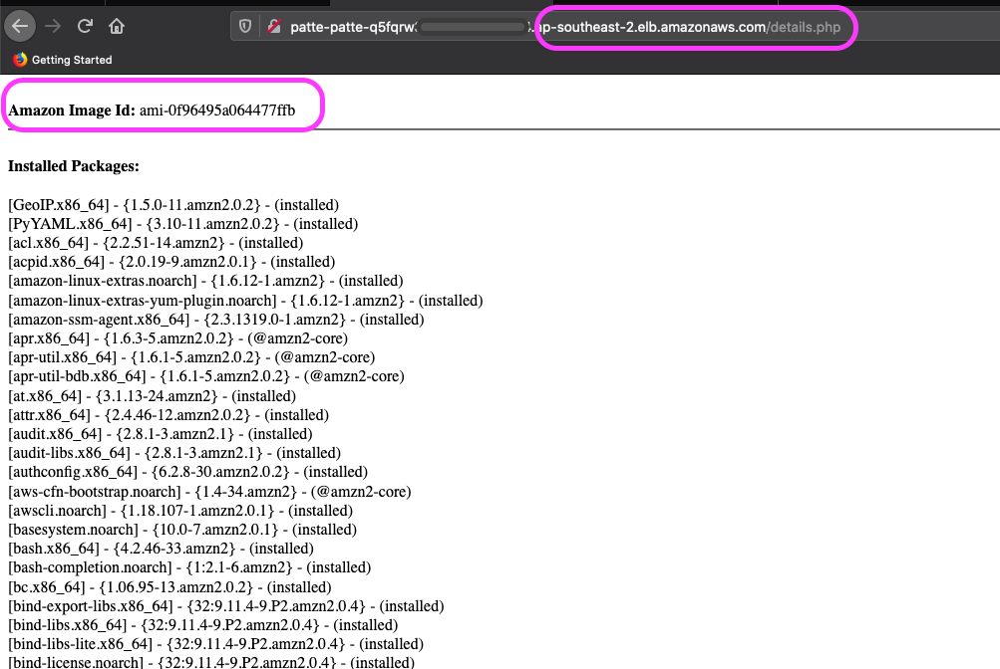
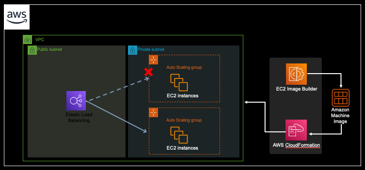
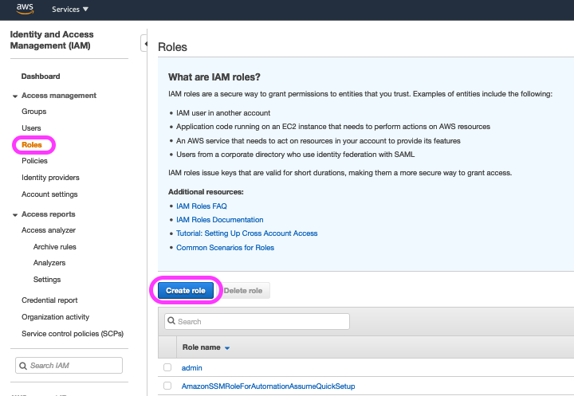
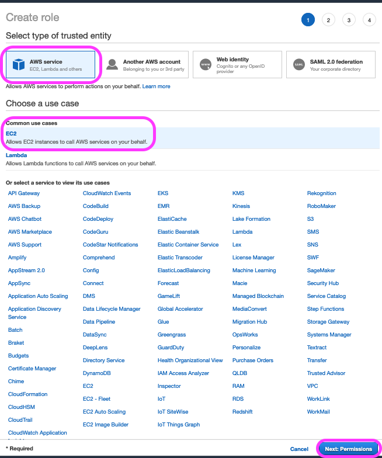
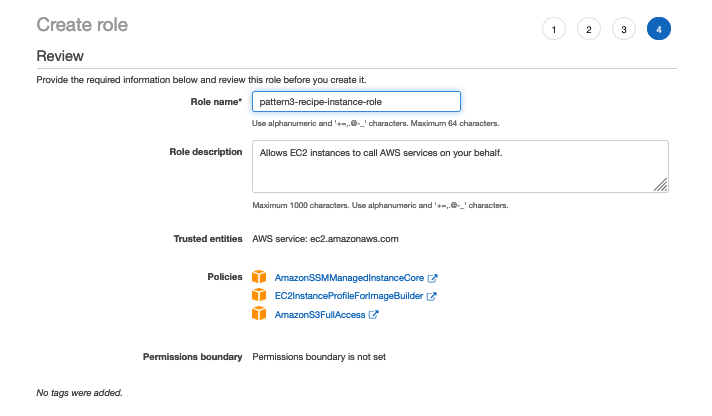
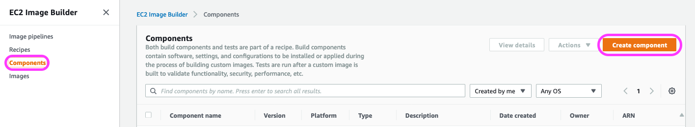
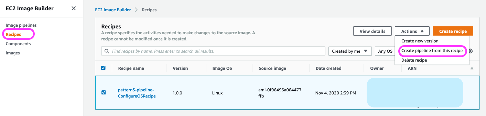

# ReInvent2020 Security The Well-Architected Way with WeInvest - Pattern 3
### By Tim Robinson and Stephen Salim

## Introduction 

Patching is a vitual component to any security strategy in terms of ensuring that your compute environments are operating with the latest code revisions available. This ensures that all security updates are applied which reduces the potential attack surface of your workload. In terms of compliance, almost all frameworks will require evidence of a patching strategy of some sort, so ensuring that you have an automated solution in place will reduce your operational overhead, patch your environment to the latest operating system code and also provide the appropriate logging which could assist you during a future compliance audit.

There are a number of different patching methods available using native AWS services, but we have decided to utilize a combination of EC2 Patch Manager and Systems Manager for this lab. This approach has the advantage of being able to work in a blue/green deployment scenario, whereby a parallel (patched) compute environment is created which run alongside your existing environment. This method allows for the cloudformation stack to be updated with the new environment details during a cutover scenario, together with an option to failback if needed. 

Our lab is split into a number of individual sections as follows:

1. Deploy the Base Infrastructure.
2. Deploy the Application Infrastructure.
3. Deploy the AMI Builder Pipeline.
4. Deploy the Build Automation.

We have included CloudFormation templates for the first few steps to get your started, and also provide optional templates for the rest of the lab so you can choose between creating the pipeline and automation documents manually or simply running the template to see the end result.

For ease of use, we have used Sydney as the default deployment region, so ensure that you are working from there for the duration of the lab.

## 1. Deploy the lab base infrastructure

The first section of the lab will build out a VPC, together with public and private subnets across two AZs. In addition, we will create an internet gateway and NAT gateway and the necessary routes from both public and private subnets. When we are completed our initial environment will look like this:




To deploy the first CloudFormation template, you can either deploy directly from the command line or via the console. 

You can get the template [here](https://github.com/skinnytimmy/ReInvent2020_labs/blob/Pattern3/Pattern3/templates/section1/pattern3-base.yml "Section1 template").

To deploy from the command line, ensure that you have appropriate access keys in place and run the following command:

```
aws --region ap-southeast-2 cloudformation create-stack --stack-name <name of your vpc stack> --template-body file://pattern3-base.yml
```
If you decide to deploy the stack from the console, ensure that you name the stack 'pattern3-base' as this is referenced by other stacks later in the lab.

When the CloudFormation template deployment is completed, note the outputs as they may be required later and move to section 2. You will need the VPC details for later.


## 2. Deploy the Application Infrastructure

The second section of the lab will build out the application stack within the VPC. This will comprise of the following assets:

* Application Load Balancer (ALB), Target Group and listener.
* Autoscaling Group and Launch Configuration.
* Security Groups for the ALB and instances.

This will add to your base architecture as follows:



To deploy the second CloudFormation template, you can either deploy directly from the command line or via the console.

You can get the template [here](https://github.com/skinnytimmy/ReInvent2020_labs/blob/Pattern3/Pattern3/templates/section3/pattern3-app.yml "Section2 template").

 To deploy from the command line, run the following command:

```
aws --region ap-southeast-2 cloudformation create-stack --stack-name pattern3-app --template-body file://baseline-application.yml --parameters ParameterKey=AmazonMachineImage,ParameterValue=ami-0f96495a064477ffb	ParameterKey=BaselineVpcStack,ParameterValue=pattern3-base 
```

Note that for the AmazonMachineImage, please use an AMI ID which represents an Amazon Linux 2 machine image from the Sydney region (ap-southeast-2).

If you decide to deploy rhe stack from the console, ensure that you provide the correct stack name from section 1 (we have used pattern3-base for the example). In addition, you will need to provide the AMI ID of an Amazon Linux 2 image, which you can find from the EC2 console. Dont forget to click the tickbox at the bottom of the screen to acknowledge that CloudFormation will create resources.

When the CloudFormation template deployment is completed, note the outputs as they may be required later.

You can check that the ALB deployment has been successful by clicking on the DNS name of the ALB which can be found in the outputs to the CloudFormation stack as follows:



If you have configured everything correctly, you should be able to view a webpage with 'Welcome to Re:Invent 2020 The Well Architected Way' as the page title. 

Adding a simple 'details.php' to the end of your DNS address will list the packages currently available, together with the AMI which has been used to create the instance as follows:




When you have confirmed that the application deployment was successful, move to section 3 which will deploy your AMI Builder Pipeline.


## 3. Deploy the AMI Builder Pipeline.

This section will concentrate on building out the AMI Builder Pipeline. Upon completion, we will add an EC2 Image Builder component, which will be responsible for taking the existing AMI Image which we have been using within our ALB configuration, building out a temporary instance before patching it and saving the image for deployment into a new autoscaling configuration. We can then use CloudFormation to update our existing stack to ensure that we are now pointing to the new autoscaling group from the application load balancer as shown in the following diagram:




If you are keen to complete the lab quickly, you can simply deploy the template for section3 which can be found [here](https://github.com/skinnytimmy/ReInvent2020_labs/blob/Pattern3/Pattern3/templates/section3/pattern3-pipeline.yml "Section3 template").

When you have downloaded the template, simply enter the baseline VPC stack name (pattern3-base unless you have entered an alternative) and add in the AMI ID which you have used in section 2 (the AMI ID should be an Amazon Linux 2 image).


Alternatively, if you want to go through the process manually to get an understanding of the Image Builder service. To do this you will need to complete the following subtasks:

* Create an IAM role for use by the EC2 Image Builder.
* Create an S3 bucket for logging purposes.
* Create an Image Builder Component.
* Create an Image Builder Recipe.
* Create an Image Builder Pipeline.

---

### 3.1. Create IAM role

Firstly we will need to create an IAM role for use by the Image Builder. To do this, navigate to IAM within the console and select 'role' from the left hand panel and then select 'create role' as shown:



Select 'AWS Service' from the types of trusted entities and then select 'EC2', and 'next: Permissions' as shown:



Using the filter, add the following policies:

* EC2InstanceProfileForImageBuilder
* AmazonS3FullAccess
* AmazonSSMManagedInstanceCore 

and click 'Next:Tags'.

On the next screen click 'Next:Review'.

Enter 'pattern3-recipe-instance-role' for the Role Name and add a description. The three policies listed above should be added as follows:





---

### 3.2. Create an S3 Bucket.

We use an S3 bucket for logging the EC2 Image Build process, so lets create one. 

As S3 is a global namespace, please use the naming convention pattern3-reinvent2020-logging with a unique UUID number at the end. You can achieve this on a mac or UNIX terminal by setting a variable called $bucket as follows:

```
bucket=pattern3-reinvent2020-logging-`uuidgen | awk -F- '{print tolower($1$2$3)}'`
echo $bucket
```

Hopefully you should have a bucket name returned to you which you can then use to create the bucket as follows:

```
aws s3 mb s3://$bucket --region ap-southeast-2 
```

Alternatively you can use any randomized string at the end of the standard bucket name and create a bucket manually.

---

### 3.3. Create a Security Group.

Our EC2 Image Build pipeline is going to need a security group created at a later stage in the configuration, so lets create one now so that we can include it later.

Complete the following steps:

**3.3.1.** Navigate to VPC 

### 3.4. Create a Component.

Now we will need to create a component for use within the Image Builder pipeline. To do this, complete the following steps:

**3.4.1.** Navigate to the EC2 Image Builder service from the console main page.


**3.4.2.** From the EC2 Image Builder service, select 'Components' from the left hand menu and then select 'create component' as shown here:




**3.4.3.** Add the following values to create a component, leaving the remainder as default:

* **Version:** 1.0.0
* **Platform** Linux
* **Compatible OS versions:** Amazon Linux 2
* **Component Name:** pattern3-pipeline-ConfigureOSComponent
* **Description:** Component to update the OS with latest package versions.


When you have completed this, enter the following text in the definition document with 'define document content' selected. 


Note that the indentation is meaningful, so try and copy the below exactly.


```
name: ConfigureOS
schemaVersion: 1.0
phases:
  - name: build
    steps:
      - name: UpdateOS
        action: UpdateOS
```


When you have completed these inputs, select 'create component' to complete the component setup.


## 3.5. Create An Image Builder Recipe.

In image builder, create a recipe. To do this, complete the following steps:


**3.5.1.** Select Recipes from the left hand menu and then select 'create recipe'.
**3.5.2.** Enter the following as configuration details:

* Name: pattern3-pipeline-ConfigureOSRecipe
* Version: 1.0.0
* Description: Pattern3 Configure OS Recipe
* Select 'Enter custom AMI ID' and enter: the AMI ID which you are using for the lab.
* Under 'Build components' select 'Browse build components' and then filter by 'Created by me' to include the component which you created earlier.

When you have entered all of the configuration details, select 'Create Recipe' at the bottom of the screen.

## 3.6. Create An Image Builder Pipeline Using the Recipe from [3.5.]

**3.6.1** Remain in the Image Builder Recipe screen and use the tick box to select the recipe which you just created.
**3.6.2** From the 'Actions' menu, select 'Create pipeline from this recipe' as shown here:



**3.6.3** Enter the following information to configure the pipeline:

* **Name:** pattern3-pipeline
* **Description:** Pattern 3 pipeline to update OS.
* **Role:** Specify the instance role which you created in step **3.1**.
* **Build Schedule:** Manual
* **Infrastructure Settings/Instance Type:** Select an M4.large here if possible, although smaller instances can be used.
* **VPC, subnet and security groups/Virtual Private Cloud:** Select the VPC that you created in section 1 of the lab (the output components will list the VPC details).
* **VPC, subnet and security groups/Subnet ID:** Select the private subnet ID from section 1 of the lab.
* **VPC, subnet and security groups/Security Group** Select the security group which you created in section 3.3.


Note for the instance types listed, an M4.large will take 20-30 minutes to build. If you want to save costs, please use a smaller instance but be prepared to wait for a bit longer for completion.


When you have completed the above configuration, select 'Next' at the bottom of the screen to go to the next configuation page.

**3.6.4** There is nothing to configure for additional settings, so click 'Review'.


## 3.7. Run Your Pipeline.

Now we can test the pipeline to ensure that it is working correctly. To do this simply select 'Run Pipeline' from the 'Actions' menu with the pipeline selected as shown here:


Build the systems manager document to orchestrate the execution of the image build and the deployment of our image into our cluster.


------------------------------------------

Introduction

Importance of patching instances from a security and compliance perspective.
Explain blue/green deployment group.Update policy and blue green deployment process. This is favoured over 
Explain why this is superior over previous method of using Lambda and Systems Manager to update the config.


1.  Deploy the infrastructure Cloudformation template. - explain that this is deploying VPC/blah
    Command : 
        aws cloudformation create-stack --stack-name <name of your vpc stack> --template-body file://baseline-vpc.yml

2.  Deploy the application stack.
    Command : 
        aws cloudformation create-stack --stack-name <name of your application stack> --template-body file://baseline-application.yml --parameters ParameterKey=AmazonMachineImage,ParameterValue=ami-0f96495a064477ffb	ParameterKey=BaselineVpcStack,ParameterValue=<name of your vpc stack>

        For the AmazonMachineImage use Amazon Linux 2 ( The userdata is only tested with Amazon Linux 2).
        Th image is based in Sydney.

At the end the stack should show a completed application web page with a welcome screen
    Comment : 
        Use the ELB URL, put in /details.php at the end of the url to go to the page listing AMI ID and installed packages.

3. Deploy the EC2 Image Builder template from <here> or you can go through a manual image builder setup via the following instructuions.
    Command:
        aws cloudformation create-stack --stack-name <name of your image builder stack> --template-body file://ami-builder-pipeline.yml --parameters ParameterKey=BaselineVpcStack,ParameterValue=<name of your vpc stack> ParameterKey=MasterAMI,ParameterValue=ami-0f96495a064477ffb 

        For the AmazonMachineImage use Amazon Linux 2 ( The userdata is only tested with Amazon Linux 2).
        Th image is based in Sydney.

…

Now that the stack is build, you can move to step 4 where we create the document in SSM which with be responsible for automating the image build. C

4. Create the automation document. Which will:
    1.  Call the EC2 image builder API to build a new AMI. Pipeline resource which has a recipe defined within it.
    2. Wait for the pipeline to finish and produce the AMI ID.
    3. Pass the AMI ID to perform an update stack into the application cloud formation stack.
    4. SSM will wait until the cloud formation update is complete.
    5. Because we have updated the resource, Cloudfortmation will wait until the signal for the bootstrap is completed then add the new group to the load balancer and then dehydrate the old ASG.

    Command:
        aws cloudformation create-stack --stack-name <name of your automation stack> --template-body file://automate-build-deployment.yml --parameters ParameterKey=ImageBuilderPipelineStack,ParameterValue=<name of your image builder stack> ParameterKey=ApplicationStack,ParameterValue=<name of your application stack>


5. To fully automate this, create an event trigger using EventBridge. (Event bridge feeding into the AWS Systems Manager )

Run the SSM automation document.

Note : To monitor the deployment, update the ./watchlist.sh change the URL with your ELB URL.
Run in throughout your Deployment 