# ReInvent2020 Security The Well-Architected Way with WeInvest - Pattern 3
#### Author:  Tim Robinson and Stephen Salim

----

## Introduction 

Patching is a vital component to any security strategy, it ensures that your compute environments are operating with the latest code revisions available. 
This in turn, also means that you are running with the latest security updates for the system, which ultimately reduces the potential attack surface of your workload. In terms of compliance, almost all frameworks will also require evidence of patching strategy or some sort. So patching needs to be done on a regular basis, and depending on the criticality of the workload, it also needs to be managed in a way that pose very little impact to the workload's availability. Often time patching works requires a lot of operational overhead that is either done by the Security or Operations team.

So ensuring that you have a automated solution for patching your workload, will ensures that your workload is at it's best security posture, while at the same time reduce the operational overhead. Patching your environment in an automated fashion will also allow traceability that can potentially be useful for your future compliance audit.

There are multiple different approach available to automate operating system patching using AWS services. One approach is to build an entirely new [Amazon Machine Image (AMI)](https://docs.aws.amazon.com/AWSEC2/latest/UserGuide/AMIs.html) that contains the latest operating system patch, and deploy them into the application cluster.

In this lab we will walk you through this approach, by utilizing a combination of AWS services & features, namely :

 * [EC2 Image Builder](https://aws.amazon.com/image-builder/) to automate creation of the [AMI](https://docs.aws.amazon.com/AWSEC2/latest/UserGuide/AMIs.html)
 * [Systems Manager Automated Document](https://aws.amazon.com/systems-manager/) to orchestrate the execution.
 * [CloudFormation](https://aws.amazon.com/cloudformation/) with [AutoScalingReplacingUpdate ](https://docs.aws.amazon.com/AWSCloudFormation/latest/UserGuide/aws-attribute-updatepolicy.html) update policy, to gracefully deploy the newly created AMI into the workload with minimal interruption to the application availability.

We will walk you through the lab in stages with examples using both manual deployments and [CloudFormation](https://aws.amazon.com/cloudformation/) templates to assist.

Our lab is divided into several sections as follows:

1. Deploy the Base Infrastructure.
2. Deploy the Application Infrastructure.
3. Deploy the AMI Builder Pipeline.
4. Deploy the Build Automation with SSM.

We have included CloudFormation templates for the first few steps to get your started, and also provide optional templates for the rest of the lab so you can choose between creating the pipeline and automation documents manually or simply running the template to see the end result.

##### Important Note :
  * For simplicity, we have used Sydney 'ap-southeast-2' as the default region for this lab. 
  * We have also pre configured the Golden Amazon Machine Image Id to be the AMI id of **Amazon Linux 2 AMI (HVM)** in Sydney region `ami-0f96495a064477ffb`. If you choose to to use a different region, please change the AMI Id accordingly for your region. 
  * To deploy the cloudformation template in this lab, you will need to have **AWS CLI (Command Line)** installed & configured, please follow this [guide](https://docs.aws.amazon.com/cli/latest/userguide/cli-chap-install.html) to do so :

----
## 1. Deploy the lab base infrastructure

In this section, we will build out a [Virtual Public Cloud (VPC)](https://docs.aws.amazon.com/vpc/latest/userguide/what-is-amazon-vpc.html), together with public and private subnets across two [Availability Zones](https://docs.aws.amazon.com/AWSEC2/latest/UserGuide/using-regions-availability-zones.html), [Internet Gateway](https://docs.aws.amazon.com/vpc/latest/userguide/VPC_Internet_Gateway.html) and [NAT gateway](https://docs.aws.amazon.com/vpc/latest/userguide/vpc-nat-gateway.html) along with the necessary routes from both public and private subnets. This VPC will become the baseline network architecture where the application will run. When we are completed our initial environment will look like this:


Building each components in this section manually will take a bit of time, and because our objective in this lab is to show you how to automate patching through AMI build and deployment. To save time, we have created a cloudformation template that you can deploy to expedite the process.
Please follow the steps below to do so : 

### 1.1. Get the Cloudformation Template.

To deploy the first CloudFormation template, you can either deploy directly from the command line or via the console. 

You can get the template [here](https://raw.githubusercontent.com/skinnytimmy/ReInvent2020_labs/Pattern3/Pattern3/templates/section1/pattern3-base.yml "Section1 template").

##### Command Line:

To deploy from the command line, ensure that you have installed and configured AWS CLI with the appropriate credentials.

  1. Execute below command to create the base stack.
      ```
      aws cloudformation create-stack --stack-name pattern3-base \
                                      --template-body file://pattern3-base.yml \
                                      --region ap-southeast-2 
      ```

  2. Once the command deployed successfully, go to your [Cloudformation console](https://console.aws.amazon.com/cloudformation/home?region=ap-southeast-2) to locate the stack named `pattern3-base`, 
  3. Confirm that it is on **'CREATE_COMPLETE'** state. 
  4. Take note of this stack name as we will need it for section number 2

##### Console:

If you decide to deploy the stack from the console, ensure that you follow below requirements & step:

  1. Please follow this [guide](https://docs.aws.amazon.com/AWSCloudFormation/latest/UserGuide/cfn-console-create-stack.html) for information on how to deploy the cloudformation template.
  2. Use `pattern3-base` as the **Stack Name**, as this is referenced by other stacks later in the lab.

### 1.2. Note Cloudformation Template Outputs

When the CloudFormation template deployment is completed, note the outputs of the stack created.
You can do this by clicking on the stack name you just created, and select the Outputs Tab as shown in diagram below.
Please take note of the :
  * VPC Id specified under **OutputPattern3VPC** output
  * SubnetId specified under **OutputPattern3PrivateSubnet1**

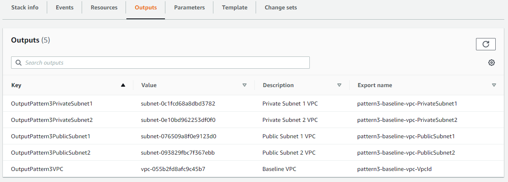


----

## 2. Deploy the Application Infrastructure

The second section of the lab will build out the sample application stack what will run in the VPC. This application stack will comprise of the following :
* [Application Load Balancer (ALB)](https://docs.aws.amazon.com/elasticloadbalancing/latest/application/introduction.html).
* [Autoscaling Group](https://docs.aws.amazon.com/autoscaling/ec2/userguide/AutoScalingGroup.html.) along with it's Launch Configuration.

Once you completed below steps, you base architecture will be as follows:


Building each components in this section manually will take a bit of time, and because our objective in this lab is to show you how to automate patching through AMI build and deployment. To save time, we have created a cloudformation template that you can deploy to expedite the process.
Please follow the steps below to do so : 


### 2.1. Get the Cloudformation Template.

To deploy the second CloudFormation template, you can either deploy directly from the command line or via the console. 

You can get the template [here](https://raw.githubusercontent.com/skinnytimmy/ReInvent2020_labs/Pattern3/Pattern3/templates/section2/pattern3-application.yml "Section2 template").


##### Command Line:

1. To deploy from the command line, ensure that you have installed and configured AWS CLI with the appropriate credentials.

    ```
    aws cloudformation create-stack --stack-name pattern3-app \
                                    --template-body file://pattern3-application.yml \
                                    --parameters  ParameterKey=AmazonMachineImage,ParameterValue=ami-0f96495a064477ffb	\
                                                  ParameterKey=BaselineVpcStack,ParameterValue=pattern3-base \
                                    --capabilities CAPABILITY_IAM \
                                    --region ap-southeast-2  
    ```
    ###### Important Note :
      * For simplicity, we have used Sydney 'ap-southeast-2' as the default region for this lab. 
      * We have also pre configured the Golden Amazon Machine Image Id to be the AMI id of **Amazon Linux 2 AMI (HVM)** in Sydney region `ami-0f96495a064477ffb`. If you choose to to use a different region, please change the AMI Id accordingly for your region. 


##### Console:

If you decide to deploy the stack from the console, ensure that you follow below requirements:

1. Please follow this [guide](https://docs.aws.amazon.com/AWSCloudFormation/latest/UserGuide/cfn-console-create-stack.html) for information on how to deploy the cloudformation template. 
2. Use `pattern3-app` as the **Stack Name**.
3. Provide the name of the vpc cloudformation stack you create in section 1 ( we used `pattern3-base` as default ) as the **BaselineVpcStack** parameter value. 
4. Use the AMI Id of **Amazon Linux 2 AMI (HVM)** as the **AmazonMachineImage** parameter value. ( In Sydney region `ami-0f96495a064477ffb` if you choose to to use a different region, please change the AMI Id accordingly for your region. )


### 2.2. Confirm Successful Application Installation

Once the stack creation is complete, let's check that the application deployment has been successful. 
To do this follow below steps: 

1. Go to the **Outputs** section of the cloudformation stack you just deployed.
2. Note the value of **OutputPattern3ALBDNSName** and you can find the DNS name as per screen shot below:
  
3. Copy the value and paste it into a web browser.
4. If you have configured everything correctly, you should be able to view a webpage with **'Welcome to Re:Invent 2020 The Well Architected Way'** as the page title. 
5. Adding `/details.php` to the end of your DNS address will list the packages currently available, together with the AMI which has been used to create the instance as follows:
  

6. *Take note of the installed packages and AMI Id (Copy and paste this elsewhere we will use this to confirm the changes later).*
7. When you have confirmed that the application deployment was successful, move to section 3 which will deploy your AMI Builder Pipeline.

----

## 3. Deploy the AMI Builder Pipeline.

In this section we will be building our Amazon Machine Image Pipeline leveraging [EC2 Image Builder](https://aws.amazon.com/image-builder/) service. EC2 Image Builder is a service that simplifies the creation, maintenance, validation, sharing, and deployment of Linux or Windows Server images for use with Amazon EC2 and on-premises. Using this service, eliminates the automation heavy lifting you have to build in order to streamline the build and management of your Amazon Machine Image. 

Upon completion of this section we will have an Image builder pipeline that will be responsible for taking a golden AMI Image, and produce a newly patched Amazon Machine Image, ready to be deployed to our application cluster, replacing the outdated one.


In this section you have the option to build the pipeline manually using AWS console, or if you are keen to complete the lab quickly, you can simply deploy from the cloudformation template. 

To build the pipeline directly via Cloudformation template go to section 3.1.
To build the pipeline manually go to section 3.2.


### 3.1. Deploy using Cloudformation Template.

Download the template [here](https://raw.githubusercontent.com/skinnytimmy/ReInvent2020_labs/Pattern3/Pattern3/templates/section3/pattern3-pipeline.yml "Section3 template").

##### Command Line:

1. To deploy from the command line, ensure that you have installed and configured AWS CLI with the appropriate credentials.
    ```
    aws cloudformation create-stack --stack-name pattern3-pipeline \
                                    --template-body file://pattern3-pipeline.yml \
                                    --parameters  ParameterKey=MasterAMI,ParameterValue=ami-0f96495a064477ffb	\
                                                  ParameterKey=BaselineVpcStack,ParameterValue=pattern3-base \
                                    --capabilities CAPABILITY_IAM \
                                    --region ap-southeast-2  
    ```

    ###### Note :
      * For simplicity, we have used Sydney 'ap-southeast-2' as the default region for this lab. 
      * We have also pre configured the **MasterAMI** parameter to be the AMI id of **Amazon Linux 2 AMI (HVM)** in Sydney region `ami-0f96495a064477ffb`. If you choose to to use a different region, please change the AMI Id accordingly for your region. 

##### Console:

1. To deploy the template from console please follow this [guide](https://docs.aws.amazon.com/AWSCloudFormation/latest/UserGuide/cfn-console-create-stack.html) for information on how to deploy the cloudformation template. 

2. Use `pattern3-app` as the **Stack Name**.
3. Provide the name of the vpc cloudformation stack you create in section 1 ( we used `pattern3-base` as default ) as the **BaselineVpcStack** parameter value. 
4. Use the AMI Id of **Amazon Linux 2 AMI (HVM)** as the **MasterAMI** parameter value. 
  ( In Sydney region `ami-0f96495a064477ffb` if you choose to to use a different region, please change the AMI Id accordingly for your region. )


### 3.1.2 Take note of the ARN 

When the CloudFormation template deployment is completed, note the outputs of the stack created.
You can do this by clicking on the stack name you just created, and select the Outputs Tab as shown in diagram below.
Please take note of the :
  * Pipeline ARN specified under **Pattern3ImagePipeline** output

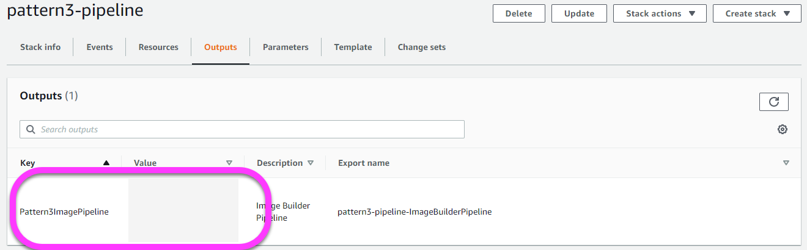


### 3.2 Deploy manually using Console.

In this section we will go through the process manually to get a better understanding of the how the pipeline is constructed in EC2 Image Builder service. 
To build this pipeline there are several subtasks we need to do:
* Create an S3 bucket for logging purposes.
* Create an IAM role for use by the EC2 Image Builder.
* Create an Image Builder Component.
* Create an Image Builder Recipe.
* Create an Image Builder Pipeline.


### 3.2.1 Create an S3 Bucket.

We are going to use an S3 bucket to store the the EC2 Image Build process, so lets create one. 
1. As S3 is a global namespace, for consistency please use the naming convention `pattern3-logging` with a unique UUID number at the end. 
  You can achieve this on a mac or UNIX terminal by setting a variable called $bucket as follows:  
    ```
    bucket=pattern3-logging-`uuidgen | awk -F- '{print tolower($1$2$3)}'`
    echo $bucket
    ```

3. Hopefully you should have a bucket name returned to you which you can then use to create the bucket as follows:
    ```
    aws s3 mb s3://$bucket --region ap-southeast-2 
    ```
4. Alternatively you can use any randomized string at the end of the standard bucket name and create a bucket manually through the console.
5. Please refer to this [guide](https://docs.aws.amazon.com/AmazonS3/latest/user-guide/create-bucket.html) to create S3 bucket.

---

### 3.2.2 Create IAM role

Firstly we will need to create an IAM role that will be used by the EC2 Image Builder service.This IAM role will be used as the instance profile role of the temporary EC2 instance the service will launch. The service will use this instance to run the necessary activity, in this case our patch update. Therefore the role will need to have the appropriate policies to do this activity.

Follow below steps to create the IAM role.
1. To do this, navigate to IAM within the console and select 'role' from the left hand panel and then select 'create role' as shown:
    

2. Select 'AWS Service' from the types of trusted entities and then select 'EC2', and 'next: Permissions' as shown:
    

3. Using the filter, search & select the following policies:
    * EC2InstanceProfileForImageBuilder
    * AmazonSSMManagedInstanceCore 

4. Click **Next:Tags**.
5. On the next screen click **Next:Review**.
6. Enter `pattern3-recipe-instance-role` for the Role Name and add a description. The three policies listed above should be added as follows:
    
7. In the IAM console, locate the role you just created.
8. Click on the role and click **+ Add inline policy**
9. Select the **JSON** Tab and paste in below policy, replace the `<s3 logging bucket>` in the json snippet below with the bucket name you created in previous step.
    ```
    {
      "Version": "2012-10-17",
      "Statement": [
          {
              "Effect": "Allow",
              "Action": "s3:*",
              "Resource": [
                  "arn:aws:s3:::<s3 logging bucket>/*"               
              ]
          }
      ]
    }
    ```
10. Click **Review Policy** 
11. Enter a name for the policy, and click **Create Policy**
12. Once you are done with this, you should now see another entry in the Policies with the name you just specified, expanding on that you should see the policy specified as screen shot below.
  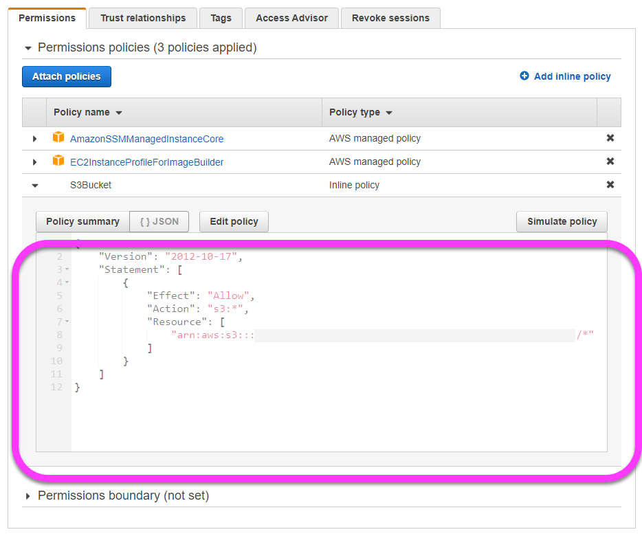

### 3.2.3 Create a Security Group.

Our EC2 Image Build pipeline is also going to need a security group that will be assigned to the temporary EC2 instance it uses.
So lets create one now so that we can include it later step.

1. Follow this [guide](https://docs.aws.amazon.com/AWSEC2/latest/UserGuide/working-with-security-groups.html) to create a Security Group.
2. For this purpose, we do not need to assign anything in the Inbound rule of the security group.
3. But we need to ensure that the outbound rules allows it to access the internet.
    Your Security group rules should look like below.
    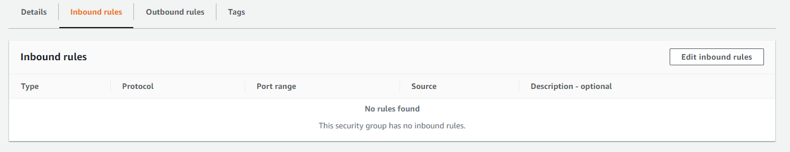
    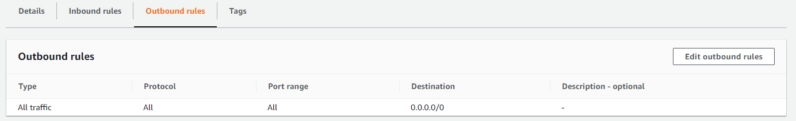

4. And you need to ensure that the security group is created in the VPC id you've taken note of in section **1.2**. 
If you don't know what is the VPC id, please refer to the instruction on section **1.2** in this lab.

5. Name the Security Group `pattern3-pipeline-instance-security-group`


### 3.2.4 Create a Component.

In this section we will create a construct in EC2 Image Builder called **Component**. This construct essentially contains instructions on what you would like to build into the AMI. For more information about EC2 Image builder Component, please refer to this [guide](https://docs.aws.amazon.com/imagebuilder/latest/userguide/how-image-builder-works.html#image-builder-component-management).
To do this, Please follow below following steps:

1. Navigate to the EC2 Image Builder service from the console main page.

2. From the EC2 Image Builder service, select **Components** from the left hand menu and then select **create component** as shown here:
  

3. Add the following values to to the options, leaving the rest of the settings as default:
    * **Version:** 1.0.0
    * **Platform** Linux
    * **Compatible OS versions:** Amazon Linux 2
    * **Component Name:** pattern3-pipeline-ConfigureOSComponent
    * **Description:** Component to update the OS with latest package versions.

    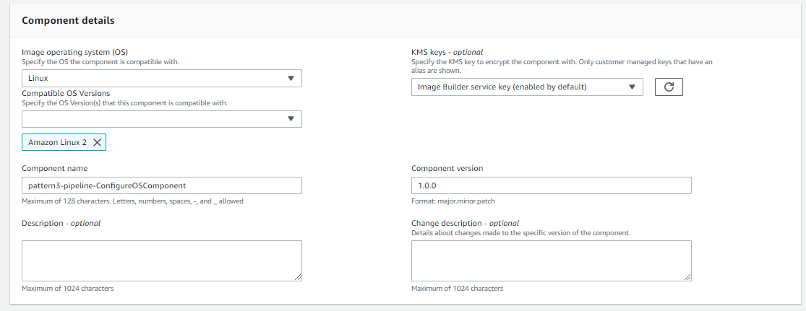


4. Once that's done, select 'Define document content'
5. Copy and paste in below definition document in the section under it. 

    ```
    name: ConfigureOS
    schemaVersion: 1.0
    phases:
      - name: build
        steps:
          - name: UpdateOS
            action: UpdateOS
    ```
    
    Please Note that this definition is specified in YAML, so please ensure indentation is correct.
    
    In this scenario, we have a very simple definition in our component, which is to run an **UpdateOS** action which will the packages in our OS. There are many other action activity you can specify in the component. For more information about EC2 Image Builder component, please refer to this [guide](https://docs.aws.amazon.com/imagebuilder/latest/userguide/image-builder-application-documents.html#document-example)

    

    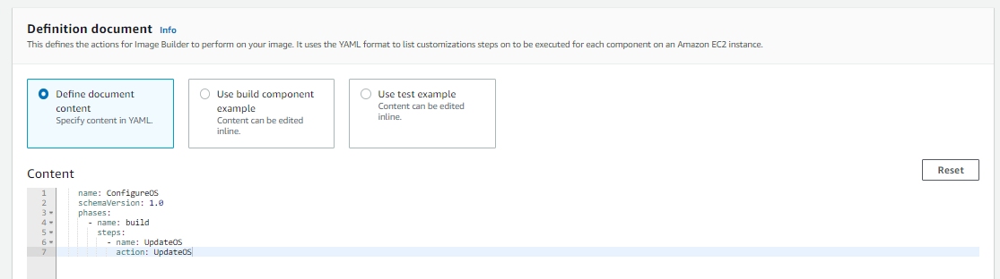


6. When you have completed these inputs, select **Create Component** to complete the component setup.


## 3.2.5. Create An Image Builder Recipe.

Next, we will create a recipe construct. Which essentially specifies that are the components, and other configuration we are going to define for our pipeline. To do this, please complete the following steps:

1. Select Recipes from the left hand menu and then select **Create Recipe**.
2. Enter the following as configuration details:
    * **Name:** pattern3-pipeline-ConfigureOSRecipe
    * **Version:** 1.0.0
    * **Description:** Pattern3 Configure OS Recipe
3. Select **Enter custom AMI ID** and enter: the AMI ID for Amazon Linux 2 AMI (HVM) in your region
    *( In Sydney region `ami-0f96495a064477ffb`, please change the AMI Id accordingly if you use other region.)*

    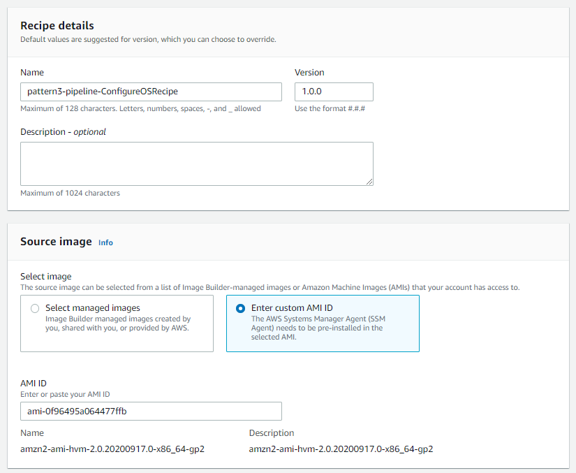

4. Under **Build components** select **Browse build components** and then filter by **Created by me** to include the component which you created earlier ( `pattern3-pipeline-ConfigureOSComponent` )/

    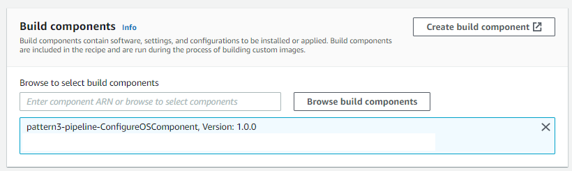


5. Once you have entered all of the configuration details, select 'Create Recipe' at the bottom of the screen.

## 3.2.6. Create An Image Builder Pipeline Using the Recipe 

Next, we will create the pipeline construct to run our recipe.
To do this, please complete the following steps:

1. Remain in the Image Builder Recipe screen and use the tick box to select the recipe which you just created.
2. From the **Actions** menu, select **Create pipeline from this recipe** as shown here:
  
3. Enter the following information to configure the pipeline:
    * **Name:** pattern3-pipeline
    * **Description:** Pattern 3 pipeline to update OS.
    * **Role:** Specify the instance role which you created in step **3.2.2**.
    * **Build Schedule:** Manual
    * **Infrastructure Settings/Instance Type:** Select an M4.large here if possible, although smaller instances can be used.
    * **Infrastructure Settings/VPC, subnet and security groups/Virtual Private Cloud:** Select the VPC that have taken note in section **1.2** of the lab (the output components will list the VPC details).
    * **Infrastructure Settings/VPC, subnet and security groups/Subnet ID:** Select the private Subnet ID from section **1.2** of the lab.
    * **Infrastructure Settings/VPC, subnet and security groups/Security Group** Select the security group which you created before in step **3.2.3**.
    * **Infrastructure Settings/Troubleshooting Settings/S3 location:** Enter the S3 bucket that you specified in section **3.2.1**.

      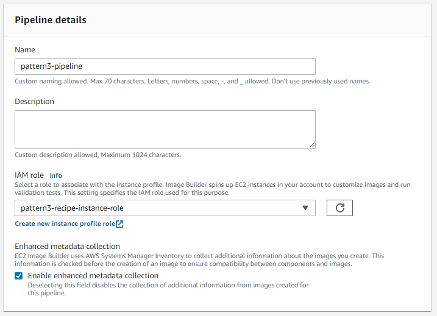

      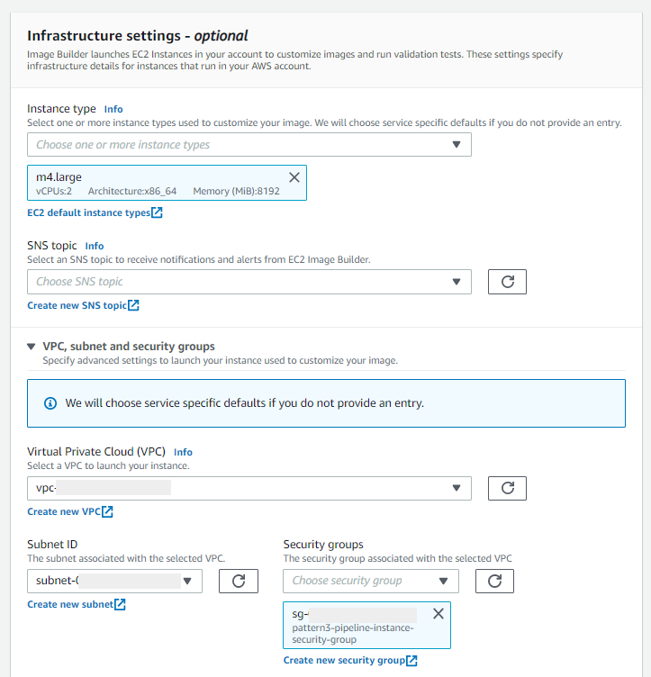

      ###### Note:
        For the instance types listed, an M4.large will take 20-30 minutes to build. 
        If you want to save costs, please use a smaller instance but be prepared to wait for a bit longer for completion.

4. Once you have completed the above configuration, select 'Next' at the bottom of the screen to go to the next configuation page
5. Leave the rest empty and click **Review**.
6. Review the configuration is according to our specification above, and click **Create Pipeline**
7. Take note of the **pipeline ARN**, as we will need this for the next section.


### 3.2.7 Run Your Pipeline.

Now that we have created all the construct, we can test the pipeline to ensure that it is working correctly. 
To do this select **Run Pipeline** from the **Actions** menu with the pipeline selected as shown here:


Once this is executed, you can observe the pipeline execution, and wait for the AMI to be built.

  ###### Note:
  EC2 Image Builder pipeline will actually execute an SSM Automation Document in the background to orchestrate all the activities in building the AMI. If you go into your System Manager Automation document console, you should be able to see the execution running, and observe the activities in more detailed. Please refer to this [guide](https://docs.aws.amazon.com/systems-manager/latest/userguide/automation-working.html) on how to view the Automation document execution details in your console. you should be able to see an execution running under **ImageBuilderBuildImageDocument** document, which is the document used by EC2 Image builder to execute it's activities.

  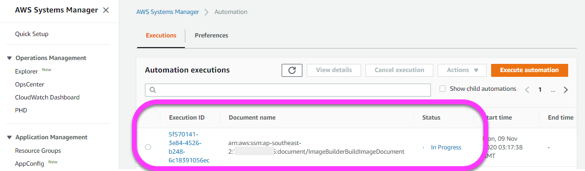


----

## 4. Deploy The Build Automation with SSM.

Now that our AMI Builder Pipeline is built, we can now work on final automation stage with Systems Manager. 
In this section we will orchestrate the building a newly patched AMI, and the deployment of the patched AMI into our application cluster. 
To automate this activities we will leverage [AWS Systems Manager Automation Document](https://docs.aws.amazon.com/systems-manager/latest/userguide/automation-documents.html). 

Using our SSM Automation document we will execute the following activities:
1. Automate the execution of the EC2 Image Builder Pipeline.
2. Wait for the pipeline to complete the build, and capture the newly created AMI with updated OS patch.
3. Then it will Update the CloudFormation application stack with the new patched Amazon Machine Image.
4. This AMI update to the stack will in turn trigger the CloudFormation [AutoScalingReplacingUpdate](https://docs.aws.amazon.com/AWSCloudFormation/latest/UserGuide/aws-attribute-updatepolicy.html) policy to perform a simple equivalent of a blue/green deployment of the new Autoscaling group. 

    ###### Note:
    With this approach we can streamline the creation of our AMI, and at the same time minimize interruption to our application.
    Leveraging the automation built in cloudformation through autoscaling update policy, also reduce the complexity and automation heavy lifting needed. 

    In this approach, once Cloudformation detects the need to update the LaunchConfiguration with a new Amazon Machine Image.
    CloudFormation will launch a new AutoScalingGroup, along with it's compute resource (EC2 Instance) with the newly patched AMI.
    CloudDormation will then wait until all instances are detected healthy by the Load balancer, before terminating the old AutoScaling Group, ultimately achieving a blue/green model of deployment. 
    Should the new compute resource failed to deploy, cloudformation will rollback and keep the old compute resource running.
    For details about how this is implemented in the CloudFormation template, please review the `pattern3-application.yml` template deployed in section **2**.

Once we complete this section our architecture will reflect the following diagram:

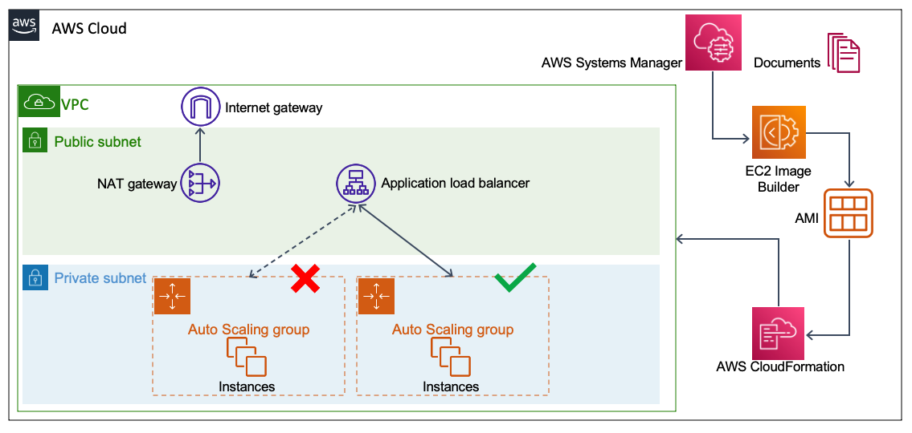


In this section you have the option to build the resources manually using AWS console, or if you are keen to complete the lab quickly, you can simply deploy from the cloudformation template. 

To build the automation document directly via Cloudformation template go to section 4.1.
To build the automation document manually go to section 4.2.


### 4.1 Get The Template.

The template for Section 4 which can be found [here](https://raw.githubusercontent.com/skinnytimmy/ReInvent2020_labs/Pattern3/Pattern3/templates/section4/pattern3-automate.yml "Section4 template").

##### Command Line:
1. To deploy from the command line, ensure that you have installed and configured AWS CLI with the appropriate credentials.
    ```
    aws cloudformation create-stack --stack-name pattern3-automate \ 
                                    --template-body file://pattern3-automate.yml \ 
                                    --parameters  ParameterKey=ApplicationStack,ParameterValue=pattern3-app \
                                                  ParameterKey=ImageBuilderPipelineARN,ParameterValue=<enter image builder pipeline arn>

    ```

##### Console:
1. To deploy the template from console please follow this [guide](https://docs.aws.amazon.com/AWSCloudFormation/latest/UserGuide/cfn-console-create-stack.html) for information on how to deploy the cloudformation template. 

2. Use `pattern3-automate` as the **Stack Name**.
3. Provide the ARN of the pipeline you created in section **3.2.6** as **ImageBuilderPipelineARN** parameter value. 
4. Provide the cloudfromation stack name you created in section **2.1** as **ApplicationStack** parameter value. 

### 4.1.1 Record The CloudFormation Output.

Once the template is finished execution, note the **Automation Document Name** from the Cloudformation output specified under **Pattern3CreateImageOutput**.

We will now go through a manual deployment of the Systems Manager Automation Document through the console which will demonstrate how to interactively build an automation document which we can run to execute the **EC2 builder pipeline** and update our AMI configuration in our running auto scale cluster via Cloudformation.

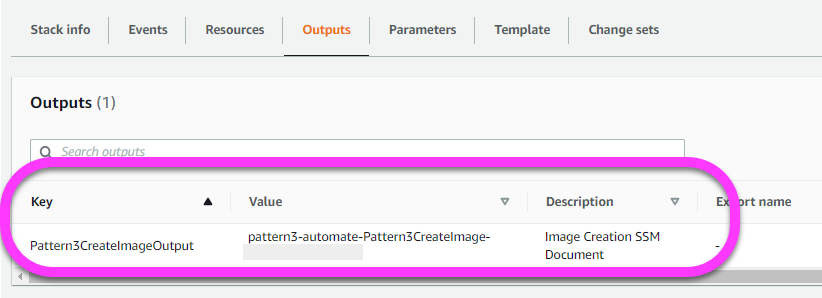


### 4.2. Create Automation Document manually via console.

In this section we will go through the steps to create the automation document, as well as explain the steps that will take place in the document.


1. Firstly access Systems Manager from the AWS Console. 
2. When you get to the front page of the service, use the left hand panel and go down to the bottom of the menu to select **Documents** from the **Shared Resources** as follows:
  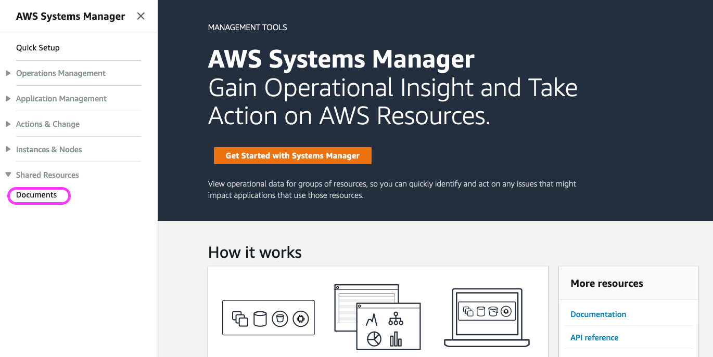.
3. From the main page, select the **Create Automation** button to build an automation document.
4. Enter the name of the automation document and select the **Editor** option to enter a the document directly into the console. 
5. Next we need to add the document specification below into the editor.
6. First we need to specify the schemaVersion and parameters our document will take as an Input.
   In this case we will take the ImageBuilderPipeline ARN as well as the name of the Application Stack (default: **pattern3-app**)


    ```
    description: CreateImage
    schemaVersion: '0.3'
    parameters:
      ImageBuilderPipelineARN:
        description: (Required) Corresponding EC2 Image Builder Pipeline to execute.
        type: String
      ApplicationStack:
        description: (Required) Corresponding Application Stack to Deploy the Image to.
        type: String
    ```
7. Next we will specify the first step which is to execute image builder pipeline we created in previous section. Passing the parameter inputs we specified before. This execution is achieved by calling the AWS service API directly leveraging [aws:executeAwsApi](https://docs.aws.amazon.com/systems-manager/latest/userguide/automation-action-executeAwsApi.html) action type in SSM Automation Document.

    ```
    mainSteps:
      - name: ExecuteImageCreation
        action: aws:executeAwsApi
        maxAttempts: 10
        timeoutSeconds: 3600
        onFailure: Abort
        inputs:
          Service: imagebuilder
          Api: StartImagePipelineExecution
          imagePipelineArn: '{{ ImageBuilderPipelineARN }}'
        outputs:
        - Name: imageBuildVersionArn
          Selector: $.imageBuildVersionArn
          Type: String
    ```

8. In the next we will specify [aws:waitForAwsResourceProperty](https://docs.aws.amazon.com/systems-manager/latest/userguide/automation-action-waitForAwsResourceProperty.html) action wait for the Image to complete building. 

    ```
      - name: WaitImageComplete
        action: aws:waitForAwsResourceProperty
        maxAttempts: 10
        timeoutSeconds: 3600
        onFailure: Abort
        inputs:
          Service: imagebuilder
          Api: GetImage
          imageBuildVersionArn: '{{ ExecuteImageCreation.imageBuildVersionArn }}'
          PropertySelector: image.state.status
          DesiredValues: 
            - AVAILABLE
    ```

9. Once the wait is complete, and the Image is ready, we will then call another [aws:executeAwsApi](https://docs.aws.amazon.com/systems-manager/latest/userguide/automation-action-executeAwsApi.html) to capture the AMI Id and pass the value into the next step.
  ```
    - name: GetBuiltImage
      action: aws:executeAwsApi
      maxAttempts: 10
      timeoutSeconds: 3600
      onFailure: Abort
      inputs:
        Service: imagebuilder
        Api: GetImage         
        imageBuildVersionArn: '{{ ExecuteImageCreation.imageBuildVersionArn }}'
      outputs:
      - Name: image
        Selector: $.image.outputResources.amis[0].image
        Type: String
  ```
10. And with the AMI id we received in previous step, we will then pass the id to our Application CloudFormation Stack and trigger an update using [aws:executeAwsApi](https://docs.aws.amazon.com/systems-manager/latest/userguide/automation-action-executeAwsApi.html) action.

  ```
    - name: UpdateCluster
      action: aws:executeAwsApi
      maxAttempts: 10
      timeoutSeconds: 3600
      onFailure: Abort
      inputs:
        Service: cloudformation
        Api: UpdateStack
        StackName: '{{ ApplicationStack }}'
        UsePreviousTemplate: true
        Parameters:
          - ParameterKey: BaselineVpcStack
            UsePreviousValue: true
          - ParameterKey: AmazonMachineImage
            ParameterValue: '{{ GetBuiltImage.image }}'
        Capabilities:
          - CAPABILITY_IAM
  ```          
11. Once the update executes we will once again wait for the Cloudformation update to complete, and return with the UPDATE_COMPLETE status.

  ```
    - name: WaitDeploymentComplete
      action: aws:waitForAwsResourceProperty
      maxAttempts: 10
      timeoutSeconds: 3600
      onFailure: Abort
      inputs:
        Service: cloudformation
        Api: DescribeStacks
        StackName: '{{ ApplicationStack }}'
        PropertySelector: Stacks[0].StackStatus
        DesiredValues: 
          - UPDATE_COMPLETE
  ```
12. We have provided commentary above, to give you a picture of what is being executed in this automation document. As a whole your Automation Document should look as below. Please copy and paste below, and make that the indentation is correct as this document is specified in YAML format. Alternatively you can download the file [here](https://github.com/skinnytimmy/ReInvent2020_labs/blob/Pattern3/Pattern3/scripts/section4_ssm_automation_document.yml)

  ```
  description: CreateImage
  schemaVersion: '0.3'
  parameters:
    ImageBuilderPipelineARN:
      description: (Required) Corresponding EC2 Image Builder Pipeline to execute.
      type: String
    ApplicationStack:
      description: (Required) Corresponding Application Stack to Deploy the Image to.
      type: String
  mainSteps:
    - name: ExecuteImageCreation
      action: aws:executeAwsApi
      maxAttempts: 10
      timeoutSeconds: 3600
      onFailure: Abort
      inputs:
        Service: imagebuilder
        Api: StartImagePipelineExecution
        imagePipelineArn: '{{ ImageBuilderPipelineARN }}'
      outputs:
      - Name: imageBuildVersionArn
        Selector: $.imageBuildVersionArn
        Type: String
    - name: WaitImageComplete
      action: aws:waitForAwsResourceProperty
      maxAttempts: 10
      timeoutSeconds: 3600
      onFailure: Abort
      inputs:
        Service: imagebuilder
        Api: GetImage
        imageBuildVersionArn: '{{ ExecuteImageCreation.imageBuildVersionArn }}'
        PropertySelector: image.state.status
        DesiredValues: 
          - AVAILABLE
  - name: GetBuiltImage
    action: aws:executeAwsApi
    maxAttempts: 10
    timeoutSeconds: 3600
    onFailure: Abort
    inputs:
      Service: imagebuilder
      Api: GetImage         
      imageBuildVersionArn: '{{ ExecuteImageCreation.imageBuildVersionArn }}'
    outputs:
    - Name: image
      Selector: $.image.outputResources.amis[0].image
      Type: String
  - name: UpdateCluster
    action: aws:executeAwsApi
    maxAttempts: 10
    timeoutSeconds: 3600
    onFailure: Abort
    inputs:
      Service: cloudformation
      Api: UpdateStack
      StackName: '{{ ApplicationStack }}'
      UsePreviousTemplate: true
      Parameters:
        - ParameterKey: BaselineVpcStack
          UsePreviousValue: true
        - ParameterKey: AmazonMachineImage
          ParameterValue: '{{ GetBuiltImage.image }}'
      Capabilities:
        - CAPABILITY_IAM
  - name: WaitDeploymentComplete
    action: aws:waitForAwsResourceProperty
    maxAttempts: 10
    timeoutSeconds: 3600
    onFailure: Abort
    inputs:
      Service: cloudformation
      Api: DescribeStacks
      StackName: '{{ ApplicationStack }}'
      PropertySelector: Stacks[0].StackStatus
      DesiredValues: 
        - UPDATE_COMPLETE
  ```

13. Once that's done click **Create Automation**

Now that we have created the Automation Document. let's go ahead and execute it.

### 4.3 Start the Monitor Script.

But before we execute the document, we have provided a simple script for you to continuously query the load balancer http address during the document execution. 
This is a to show the impact of our deployment of the new AMI to the running application. There should be minimal impact to availability throughout the deployment of the AMI.

1. Firstly, download the monitor script [here](https://raw.githubusercontent.com/skinnytimmy/ReInvent2020_labs/Pattern3/Pattern3/scripts/watchscript.sh). 

2. Execute the script, passing in the application load balancer DNS address which is in the output of the application CloudFormation stack in section **2.2** under **OutputPattern3ALBDNSName** as follows:

    ```
    ./watchscript.sh http://<enter DNS address for the Application Load Balancer>
    ```
3. This will run a continuous poll of the ALB throughout the next few steps to demonstrate that there is no interruption to traffic. 
4. For clarity, you might want to run this in a separate dedicated terminal as it will continue to poll the ALB in a loop.
5. You can leave this script running, and monitor to see if there is any failed response to the application.

    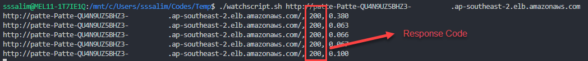

### 4.4 Start the Automation Document.

To Execute the SSM automation document, you can run the following command:

```
aws ssm start-automation-execution \
    --document-name "<enter_document_name>" \
    --parameters "ApplicationStack=<enter_application_stack_name>,imageBuilderPipeline=<enter_image_builder_pipeline_arn>"

```

Note the following:
  * The value of **<enter_document_name>** is provided as output to the CloudFormation template which you noted in section **4.1.1**, or in section **4.2** if you are building it manually.
  * The value of **<enter_application_stack_name>** is the name that you provided to the application stack in Section **2** (default is pattern3-app).
  * The value of **<enter_image_builder_pipeline_arn>** is the ARN of the Image Builder Pipeline. You can get this from the output to the pipeline stack from Section **3.1.2** or **3.2.6** if you are building it manually via the console..

When you have successfully executed the command you will be provided with an AutomationExecutionID.

To check the status of the currently running automation executions, you can use the following command:

```
aws ssm describe-automation-executions 
```

Note that you can pass a filter to the command with the AutomationExecutionID which you were provided from the automation execution as follows:

```
aws ssm describe-automation-executions --filter "Key=ExecutionId,Values=<enter_execution_id>"

```

### 4.5 Confirm that the AMI has been Updated Via the Load Balancer DNS Name.

When the automation execution is completed, use your web browser to access your application load balancer DNS name, together with the 'details.php' script added to the end of the address. You will now find that the AMI-ID has been updated with a new one, indicating that your original autoscaling group has been replaced with an updated group which is configured to use the patched AMI. as follows:


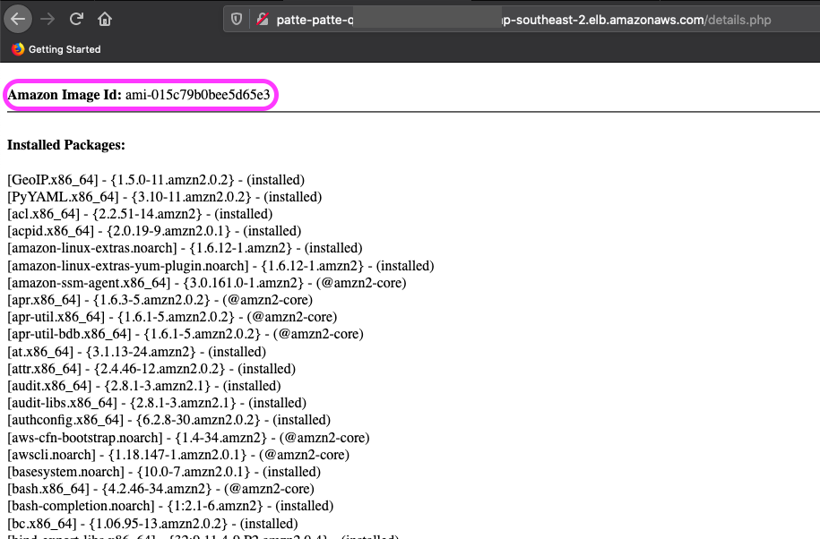


=== This concludes our lab. === 